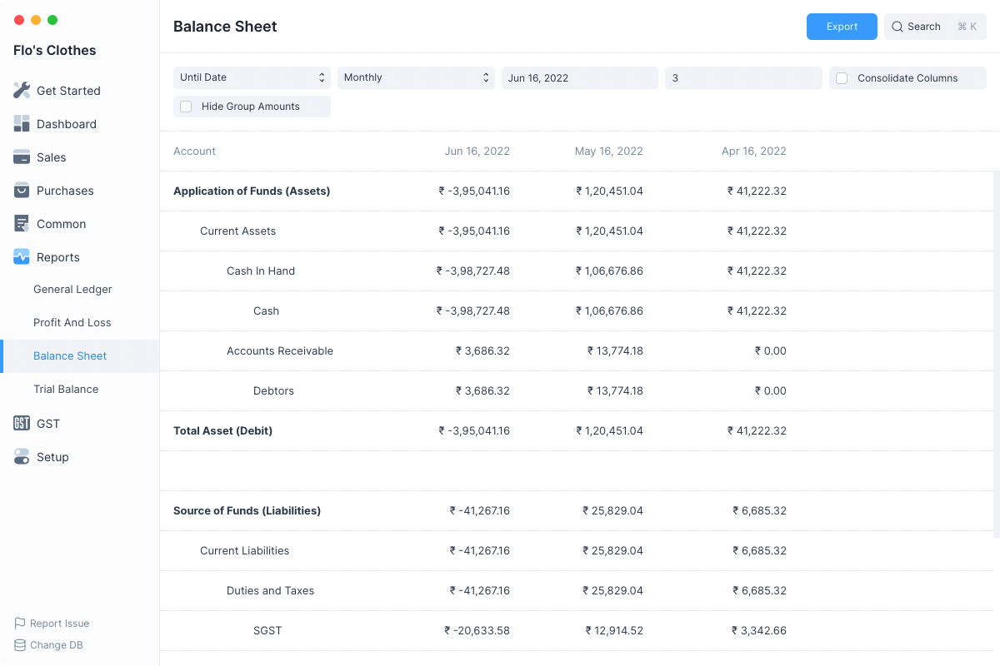
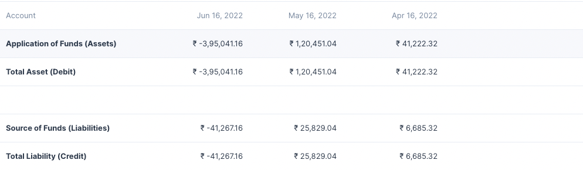

# Balance Sheet

A Balance Sheet is the financial statement of a company which states assets,
liabilities and equity at a particular point in time.

In Frappe Books, you can view the balance sheet for your accounts based on
monthly, quarterly, half-yearly, and yearly periods.

Navigate to this report from the sidebar: `Reports > Balance Sheet`

## Filters

The Balance Sheet report has several filters which can help you narrow the date
range between which to display the report.

### Based On

This allows for toggling betwee the kind of filters used set the date range. It has 2 values:

1. Until Date
2. Fiscal Year

### Periodicity

This selects the interval for which the Balance Sheet values have to be
calculated.

Example setting this to Monthly will display columns on a monthly basis.

### Date Range Filters

These filters depend on the value of Based On

| Based On    | Date Range Filters    |
| ----------- | --------------------- |
| Until Date  | To Date and Count     |
| Fiscal Year | To Year and From Year |

#### To Date and Count

**To Date** is the final date until which the report is to be displayed, by default
the values is tomorrow's date.

**Count** depends on Periodicity so if Count is 3 and Periodicity is Monthly
then the report will display Balance Sheet columns for the last three months
starting from **To Date**

#### To Year and From Year

These decide the fiscal year between which the Balance Sheet report has to be
displayed. The number of columns will depend on the Periodicity.

### Consolidate Columns

Checking this this will sum up all the values for each row and display a single
column.

### Hide Group Amounts

The Balance Sheet report format displays the group accounts such as Current Assets
along with the non group accounts such as Cash and Debtors.

Group account balances depend on the non group account balances under them,
group account balances are not directly updated.

So clicking on **Hide Group Amounts** will display only the non group account
amounts making the report a bit easier to read.

## Folding Rows

Rows in the Balance Sheet report which display group accounts can be clicked
to fold all the rows underneath them.
