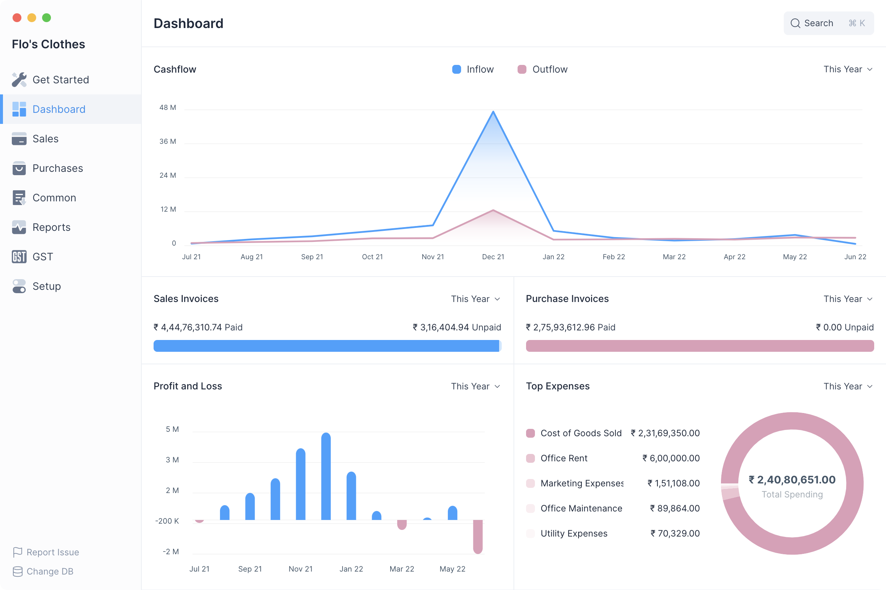

# Dashboard

Dashboard show an overview of Cash Flow, Profit and Loss, Pending Payments and
Expenses.

You can access the Dashboard from the sidebar.

### Cash Flow

The Cash Flow chart shows the total amount of money being transferred into and
out of your company over a period. The default period is the current fiscal
year.

### Pending Payments

The sales invoice section shows the total amount which is pending from your
customers for your sales. The purchase invoice section shows the total amount
that you have to pay to your suppliers for your purchases.

### Profit and Loss

This chart shows the profit (or loss) per month for a given period. The default
period is the current fiscal year.

### Top Expenses

This section shows your top expenses for the current fiscal year sorted from
your highest expenses to lowest expenses by category.
