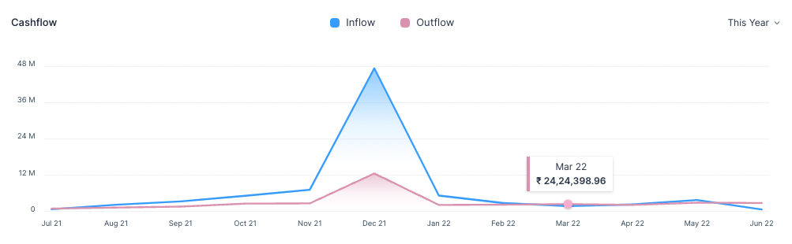
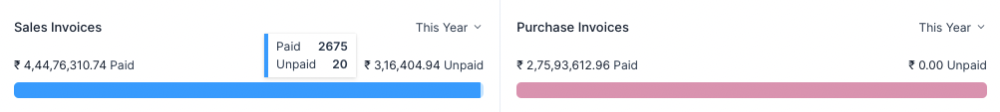
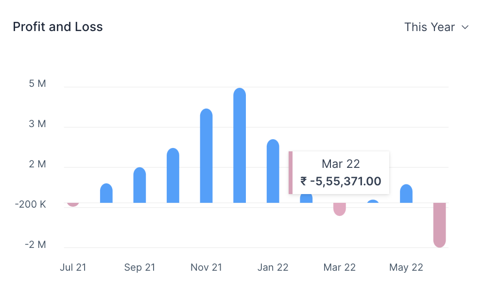
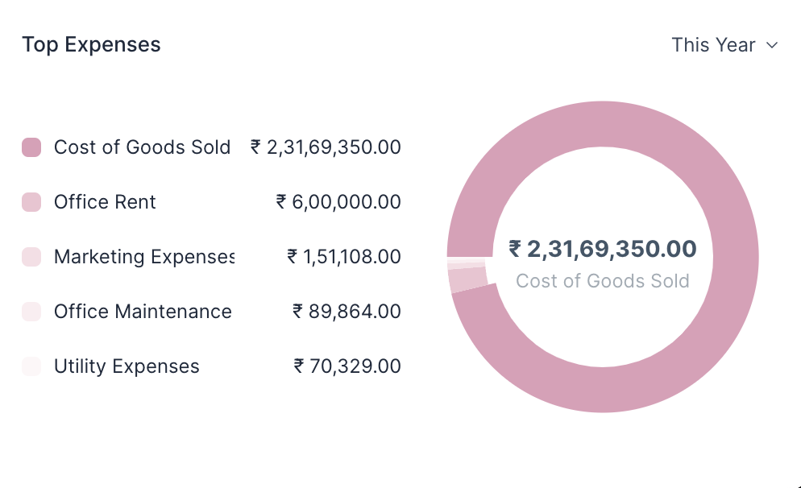

# Dashboard

Dashboard show an overview of Cash Flow, Profit and Loss, Pending Payments and
Expenses.

You can access the Dashboard from the sidebar.

## Period Selector

All sections of the Dashboard have a Period Selector. The default value is
**This Year**. There are three options.

Consider today's date as 16 Jun, 2022. The three options will show analytics for
the given range:

|   # | Option       | From         | Until (Today) |
| --: | :----------- | :----------- | :------------ |
|   1 | This Year    | 16 Jun, 2021 | 16 Jun, 2022  |
|   2 | This Quarter | 16 Mar, 2022 | 16 Jun, 2022  |
|   3 | This Month   | 16 May, 2022 | 16 Jun, 2022  |

::: info Options
The Cashflow and the Profit and Loss chart don't show the **This Month** option.
:::

## Cashflow

The Cashflow chart shows the total amount of money being transferred into and
out of your company over a period.

::: tip Cashflow
The Cashflow chart is calculated from the Cash and Bank account balances.
:::

::: info Hover
Hover tooltip shows the Inflow or Outflow amount for that month.
:::

## Pending Payments

Pending Payments shows the invoice paid and unpaid (outstanding) amounts. It has
two sub-sections

1. The Sales Invoice section shows the total outstanding amount which is pending
   from your customers for your sales.
2. The Purchase Invoice section shows the total outstanding amount that you have
   to pay to your suppliers for your purchases.

::: info Hover
Hover tooltip shows the number of Paid and Unpaid invoices.
:::

## Profit and Loss

This chart shows the profit (or loss) per month for a given period.

::: tip Profit and Loss
Profit and Loss is the difference between the Income and Expense accounts.
:::

::: info Hover
Hover tooltip shows the Profit or Loss amount for that month.
:::

## Top Expenses

This section shows your top five expenses sorted from your highest expenses to
lowest expenses by category.

::: tip Expenses
The Top Expenses chart is calculated from the Expense account balances.
:::
