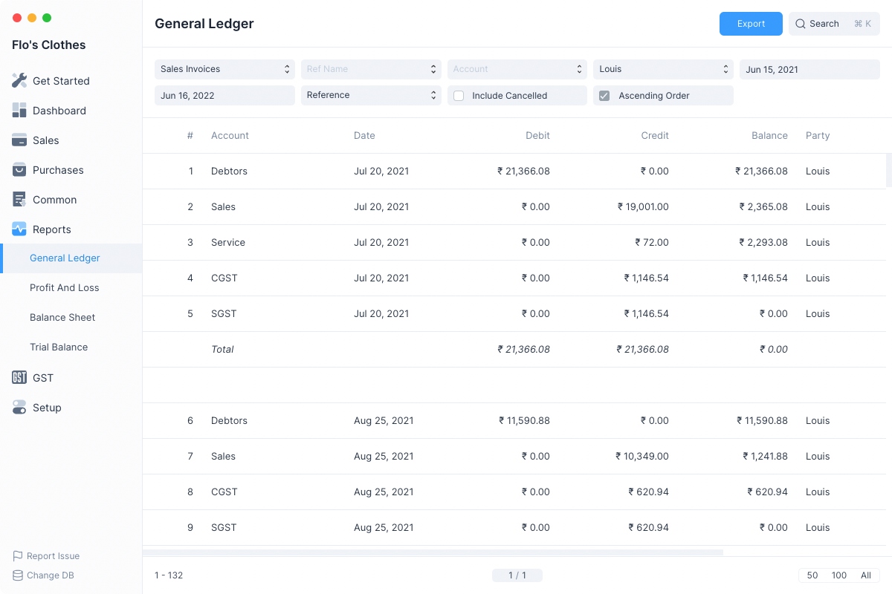

# General Ledger

The General Ledger is a detailed report for all transactions posted to each
account and for every transaction there is a Credit and Debit account so it
lists them all up.

This helps you to get a full update for all entries posted in a period against
any account.

Navigate to the General Ledger from the sidebar: `Report > General Ledger`

## Filters

The General Ledger has several filters which can help you narrow the generated
report to the entries you would like to see.

### Ref Type

Setting Ref Type as anything other than All will display entries only of that
Transactional entry type.

Example setting Ref Type as Journal Entry will display only entries created due
to Journal Entries.

### Ref Name

Ref Name filter allows to display all ledger entries that were generated due to a
single Transactional Entry.

To enable this you need to first set Ref Type.

### Account

Selecting an Account will display only entries where an amount is being credited
or debited from this account.

### Party

Selecting a Party will display only entries involving them.

### From Date

The initial date after which all the entries are to be displayed. The default
value is one year before tomorrow.

### To Date

The final date before which all the entries are to be displayed. The default
value is one day after today.

### Group By

Selecting a Group By option other than None groups the entry according to the
selected option.

For instance setting Group By as Reference will group the entries by the Name of
the transactional entry.

### Include Cancelled

Checking this will include the cancelled entries in the report.

::: info Reverted Column
A new column **Reverted** is added to indicate which of the entries have been
cancelled.
:::

### Ascending Order

By default the entries are displayed by newest entry first, i.e. descending
order of Date.

Checking this will display the entries in ascending order of entry date.
