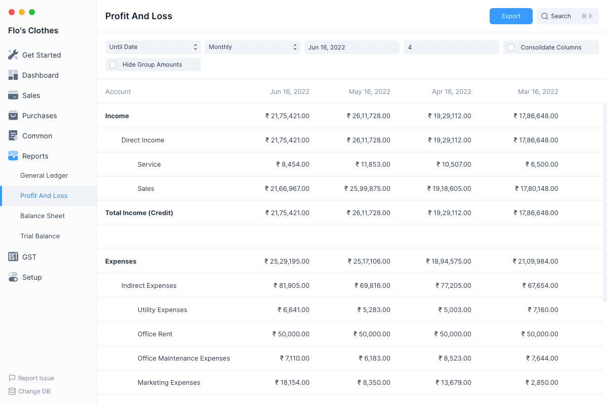
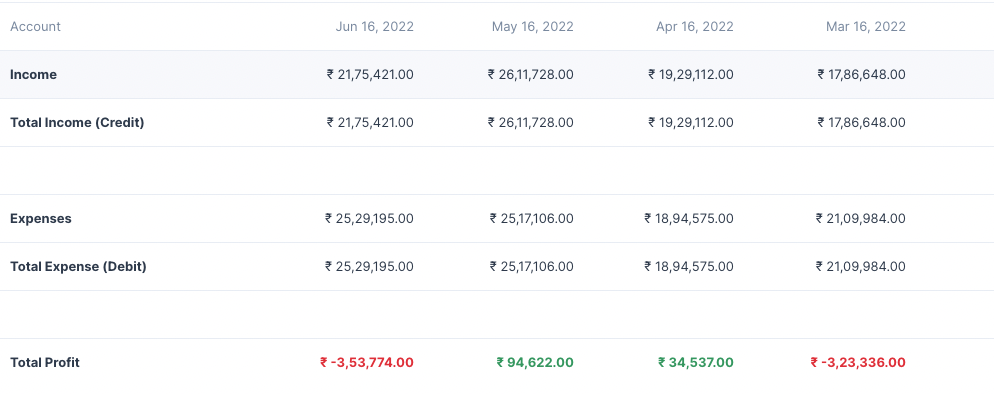

# Profit and Loss Statement

All of the money that your business earned from when it started minus the
expenses that it incurred will be the total profit (or loss) the business has
generated. But we aren’t interested in the total amount, but the amount that is
generated last month or last quarter or last year. Hence, Profit and Loss
statement is always viewed for a specific time period.

Here are some insights you can gain from this report:

1. Compare this month’s profit with last month.
2. Compare quarter wise or year wise profits or losses.
3. Find out the total profit or loss for a specific time window.

The P&L statement for any period reflects all the income minus all the expenses
in that period. At the end of the period, (a fiscal year) the total profit (or
loss) goes into Owner’s Equity because the profit in the business belongs to the
owners. The owner’s account is a liability to the company since the company has
to pay out the profits/losses.

To check your P&L statement, navigate to it using the sidebar:
`Reports > Profit And Loss`

By default the Profit and Loss report will show P&L values for the last 3
months.

As you can clearly see, we have the total Income in the first part which also
shows the income coming from each Income account split Monthly so you have a
better understanding of your income. The same is done with the Expense section.
The report is concluded by the total profit (or loss) incurred which is also
split Monthly.

## Filters

The Profit and Loss report has several filters which can help you narrow the
date range between which to display the report.

### Based On

This allows for toggling betwee the kind of filters used set the date range. It has 2 values:

1. Until Date
2. Fiscal Year

### Periodicity

This selects the interval for which the Profit and Loss has to be calculated.

Example setting this to Monthly will display columns on a monthly basis.

### Date Range Filters

These filters depend on the value of Based On

| Based On    | Date Range Filters    |
| ----------- | --------------------- |
| Until Date  | To Date and Count     |
| Fiscal Year | To Year and From Year |

#### To Date and Count

**To Date** is the final date until which the report is to be displayed, by default
the values is tomorrow's date.

**Count** depends on Periodicity so if Count is 3 and Periodicity is Monthly
then the report will display Profit and Loss columns for the last three months
starting from **To Date**

#### To Year and From Year

These decide the fiscal year between which the Profit and Loss report has to be
displayed. The number of columns will depend on the Periodicity.

### Consolidate Columns

Checking this this will sum up all the values for each row and display a single
column.

### Hide Group Amounts

The Profit and Loss report format displays the group accounts such as Direct
Income along with the non group accounts such as Sales and Services.

Group account balances depend on the non group account balances under them,
group account balances are not directly updated.

So clicking on **Hide Group Amounts** will display only the non group account
amounts making the report a bit easier to read.

## Folding Rows

Rows in the Profit and Loss report which display group accounts can be clicked
to fold all the rows underneath them.
