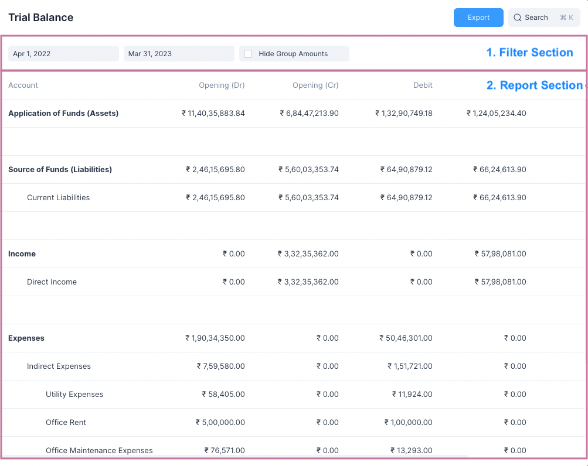

# Reports

Frappe Books has 4 financial reports. Each report is calculated using the
General Ledger Entries that are created when any
[Transactional Entry](/transactions/transactional-entries) is made.

## Sections

All repors have two sections

1. Filter Section
2. Report Section

The **Filter Section** allows for setting filters such as the Date Range between
which a report is to be generated.

::: tip Setting Filters
To generate a report after setting a filter, just click outside the filter box.
:::

The **Report Section** shows the generated report.

::: info Pagination
The **General Ledger** report also shows a paginator at the bottom which allows
for viewing only sections of the report.
:::

## Exporting a Report

All reports can be exported as a `CSV` or a `JSON` file. To do so just click on
the blue Export button and select the file path.

After exporting the report you may open it in any software of your choice such
as Libreoffice Calc, Google Sheets or Microsoft Excel.

## Report Links

Check the following links to understand these reports:

1. [General Ledger](/analytics/general-ledger)
2. [Profit and Loss](/analytics/profit-and-loss)
3. [Balance Sheet](/analytics/balance-sheet)
4. [Trial Balance](/analytics/trial-balance)
