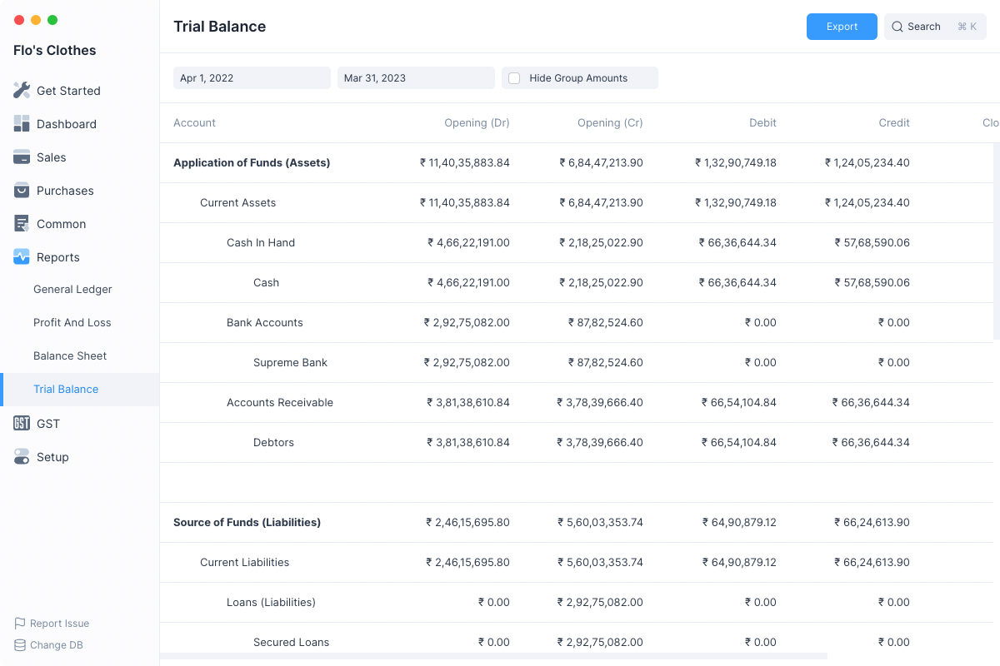
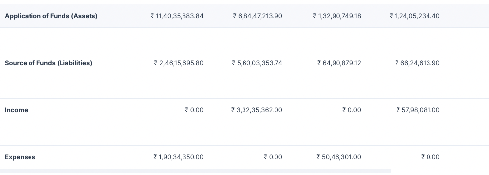

# Trial Balance

A Trial Balance is an accounting report which lists account balances for all
your Accounts (both Ledger and Group) for any given reporting period.

A company prepares a trial balance periodically, usually at the end of every
reporting period. The general purpose of producing a trial balance is to ensure
the entries in a company's bookkeeping system are mathematically correct.

The totals of Debit and Credit columns must be the same for any given period, to
ensure the entries are correct.

Navigate to this report from the sidebar: `Reports > Trial Balance`

## Filters

The Trial Balance report has filters which can help you narrow the date range
between which to display the report.

### From Date

The initial date after which the Trial Balance has to be calculated. The default
value is the first day of the current fiscal year.

### To Date

The final date before which all the Trial Balance has to be calculated. The default
value is the last day of the current fiscal year.

### Hide Group Amounts

The Trial Balance report format displays the group accounts such as Current
Liabilities along with the non group accounts such as Secured Loans and
Creditors.

Group account balances depend on the non group account balances under them,
group account balances are not directly updated.

So clicking on **Hide Group Amounts** will display only the non group account
amounts making the report a bit easier to read.

## Folding Rows

Rows in the Trial Balance report which display group accounts can be clicked to
fold all the rows underneath them.
