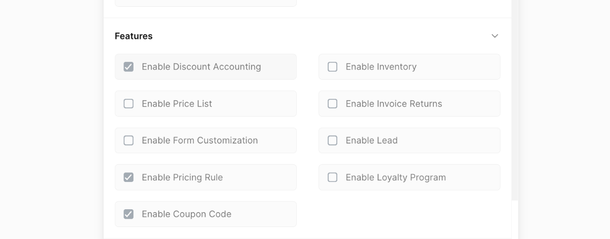
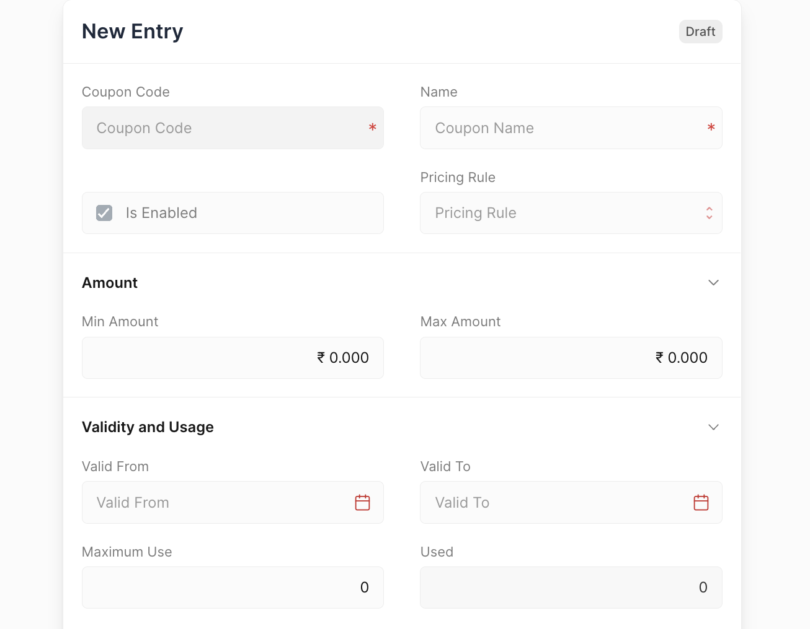
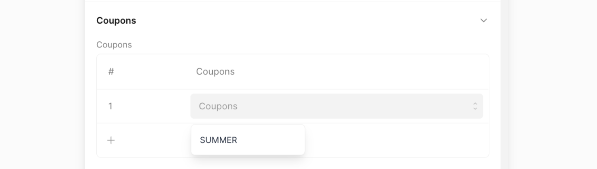
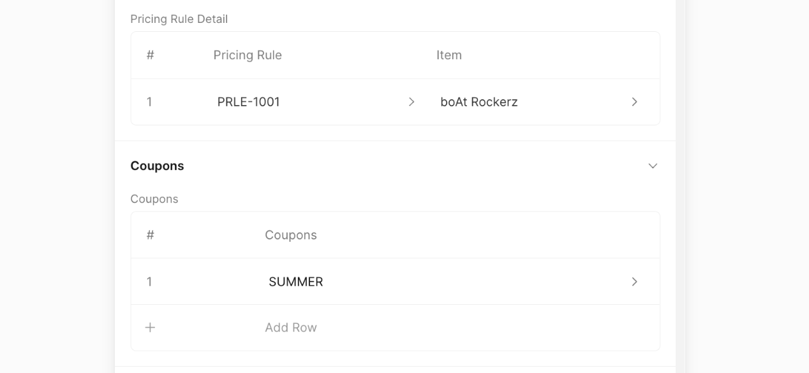

# Coupon Code

A coupon code can be used to get a discount. To use a coupon, you must first
set up a pricing rule. This rule determines the specific discount or offer
associated with the coupon. When you apply the coupon, it will follow the rules
you set up.

## Enabling Coupon Code

1. Go to `Setup > Settings`.
2. Navigate to the **Features** section.
3. Check the boxes for the **Enable Discount Accounting**,
   **Enable Pricing Rule**, and **Enable Coupon Code**.

::: info

**Discount Accounting** and **Pricing Rule** should be enabled to use
**Coupon Codes**
:::

Once that is done you will have to restart Frappe Books to see the Coupon Code
in the sidebar.

::: warning

Coupon Code cannot be disabled once it has been enabled.
:::

## Creating Coupon Code

To create a Coupon Code first navigate to the Coupon Code page

`Sales > Coupon Code`

Then click on the `+` button to open the Coupon Code form.

- **Is Enabled:** To mark the Coupon Code as active.
- **Pricing Rule:** Select the pricing rule that applies when a specific coupon
  code is used.
- **Min Amount:** Minimum order value for the rule to be applied.
- **Max Amount:** Maximum order value for the rule to be applied.
- **Valid From:** The start date for the pricing rule to be active.
- **Valid To:** End date for the pricing rule to be inactive.
- **Maximum Use:** Maximum use for the coupon to be applied.
- **Used:** Count of times the coupon has been applied.

## Apply Coupon Code

You can select coupons to get discounts. The coupon will apply a discount based
on the rules set for that coupon.

Applied Pricing rule can be viewed in the Pricing Rule Detail section.

