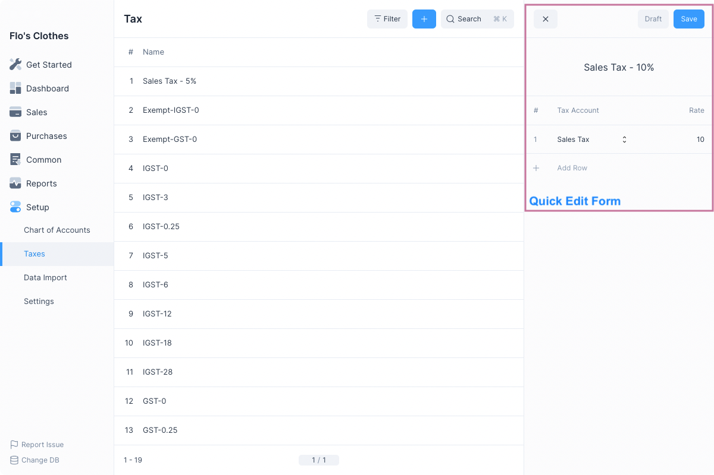
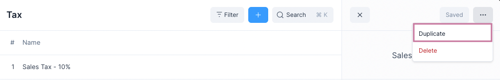
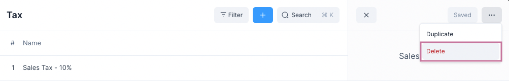

# Entries

Besides [Transactional Entries](/transactions/transactional-entries) Frappe
Books has regular entries for documents that don't affect any account's balance
directly.

Examples of these are:

- [Items](/entries/items)
- [Party](/entries/party)
- [Lead](/entries/lead)
- [Taxes](/entries/taxes)

## Creating a New Entry

To create an entry navigate to it's page first, for example for
Taxes: `Setup > Taxes`

And click on the blue `+` button, this will open the Quick Edit Form.

Enter the values and click the blue Save button. The entry will now be made and
can be used in transactions.

## Duplicating an Entry

To create the duplicate of an entry, click on the `...` menu button and select
Duplicate.

This will create a Draft entry, i.e. it is not yet saved, you can change the
values and click on Save.

After the entry has been Saved you can use it in transactions.

## Deleting an Entry

To delete an entry, click on the `...` menu button and select Delete.

::: warning Entry Deletion
Entries used in transactions cannot be deleted.

To delete these entries the Transactions where they are used will have to be
deleted first.
:::

---

Now that you know the basics of entries you can learn about specific types of
entries.
