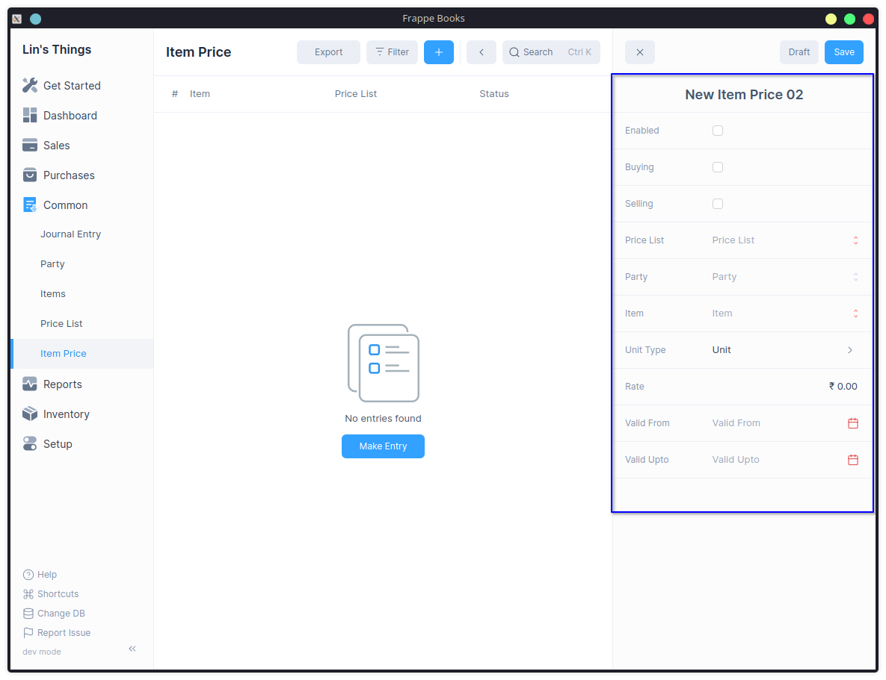

# Item Price

Item Price is a record in which you can keep track of an Item's selling and 
buying rates.

Navigate to the Item Price from the Sidebar: `Common > Item Price`

## Enable Price List

The Price List feature needs to be enabled first by checking the 
[Enable Price List](/entries/price-list#enable-price-list) option in the 
General Settings.

## Creating Item Price

1. Navigate to : `Common > Item Price > Click on "+"`
2. Check Enable to mark the Item Price as Enabled.
3. Select the Price List or click Create to create a new 
   [Price List](/entries/price-list#creating-price-list).
4. Check Buying or Selling depending on where the Item Price should be applied.
5. Choose the Party.
6. Choose the Item.
7. If the same item is purchased or sold in different UOMs, users can add 
   UOM-specific Item Prices.
8. Fill in the Rate field with the actual rate.
9. The Valid From date is set to the date when the Item Price is applicable, 
   and the Valid Upto date is set to the date when the Item Price will expire.
10. Save

## Features

### 1. Unit of Measurement (UOM)

If an item is sold in multiple UOMs, users can add UOM-specific item prices. 
For example, if an item of Rice is sold in 1 KG and 500-gram packets, users can 
specify the UOM in the item prices, and the item price will be calculated depending 
on the UOM selected in the transaction.

### 2. Applying Price List to a specific Customer/Supplier

If you choose a customer from the Party field, you can apply this Item Price 
only to that particular customer.

### 3. Applying Price List to a specific Batch

You can also link a specific Batch to an Item Price, and when that Batch is selected 
in the transaction, the Item Price for that specific Batch will be applied.

### 4. Validity

You can specify the `Valid From` date to the date when the Item Price is applicable, and 
the `Valid Upto` date to the day when the Item Price will expire.

### 5. Status

It indicates whether the Item Price is Enabled, Disabled or Expired.