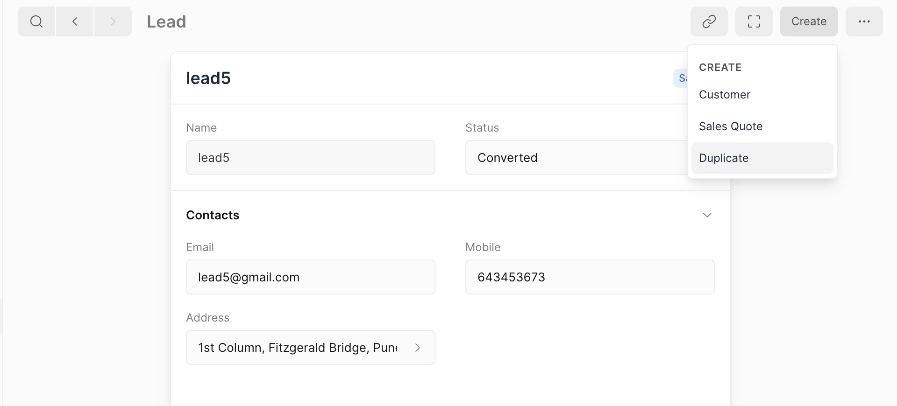

# Lead

_Lead_ is a term used in Frappe Books for any potential customer or client who has shown interest in the products or services offered.

## Lead Status

A Lead can have various statuses based on the stage of engagement:

|   # | Status         | Description                                                      |
| --: | :------------- | :--------------------------------------------------------------- |
|   1 | Open           | Newly created and yet to be engaged.                     |
|   2 | Replied        | Replied to initial engagement.                          |
|   3 | Interested     | Shown interest in the product or service.               |
|   4 | Opportunity    | Opportunity for business.                  |
|   5 | Converted      | Converted to a customer or client.                 |
|   6 | Quotation      | To sent a quotation.                                  |
|   7 | Do not Contact | Marked as not to be contacted.                     |

::: warning Usage
Ensure to update the status of the Lead appropriately as it progresses through different stages.
:::

## Lead Fields

1. **Name**: The full name of the Lead. This is a required field to uniquely identify each Lead.
2. **Status**: The current status of the Lead. It indicates the stage of engagement with the Lead and can be one of the following:
3. **Email**: The email address of the Lead. This is used for communication and may be displayed when printing invoices or other documents.
4. **Mobile**: The mobile phone number of the Lead. This is used for quick contact and may also be displayed when printing invoices or other documents.
5. **Address**: The physical address associated with the Lead. This can include street, city, state, and postal code, and is useful for sending physical correspondence or deliveries.

## Actions

The Lead Quick Edit Form includes actions to create associated documents like Customer or Sales Quote.

### Create Customer

- Converts the Lead into a Customer, retaining all relevant information.
- Sets the status of the Lead to 'Converted'.

### Create Sales Quote

- Creates a Sales Quote for the Lead.
- Links the Sales Quote to the Lead as a reference.

<!-- ### Additional Information

- Each row in the Recent Actions widget shows the following information:
  - Document Name
  - Document Status
  - Date of Creation
  - Linked Amounts (if applicable)

Clicking on a row will navigate to the corresponding document for further actions like editing or reviewing. -->
