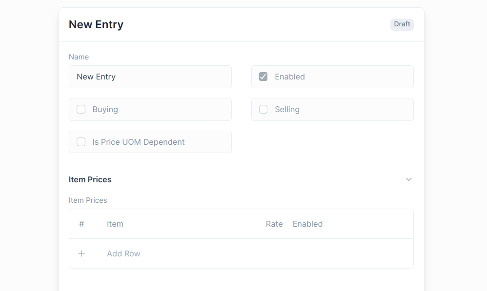
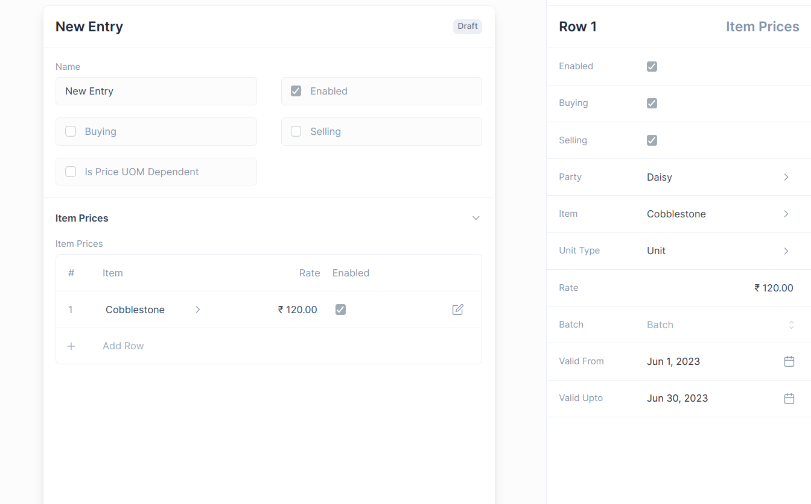
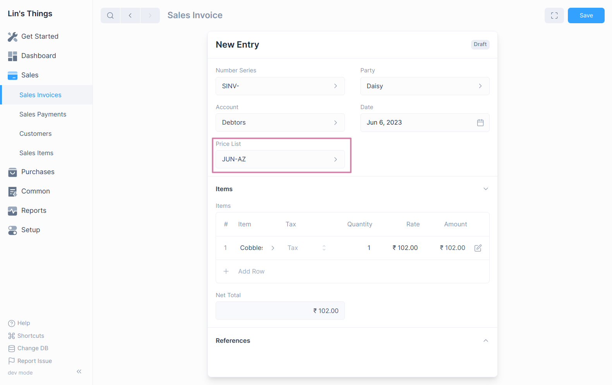

# Price List

Using Price List, you can keep track of multiple selling and buying
[Item Prices](#item-price-table-fields).

An Item can have several pricing based on the customer, whether they are
buying or selling, Batches, and so on, and these prices can be saved in
separate rate plans

To view a Price List, go to:`Common > Price List`

## Enable Price List

The Price List feature needs to be enabled first by checking the
**Enable Price List** option in the General Settings.

To navigate: `Setup > Settings > General Tab`

## Price List Fields

1. **Name**: a name to identify the Price List.
2. **Enabled**: To Enable or Disable the Price List.
3. **Buying**: Check to enable the Price List for Buying.
4. **Selling**: Check to enable the Price List for Selling.
5. **Is Price UOM Dependent**: Item Price will be only applied for the selected Unit.

## Item Price Table Fields

1. **Item**: The Item you want to set the Item Price for.
2. **Rate**: The Rate you want to set for the Item.
3. **Enabled**: Check to mark the Item Price as enabled.
4. **Buying**: Check to enable the Item Price for Buying.
5. **Selling**: Check to enable the Item Price for Selling
6. **Party**: Select a Party if you want to set an Item Price for a specific Party.
7. **Unit Type**: Select the Unit for which the Item Price is applicable.
8. **Batch**: Select a Batch if you want to set an Item Price for a specific Batch.
9. **Valid From**: The date when the Item Price becomes effective.
10. **Valid To**: The date till the Item Price is effective.

## Choosing a Price List 

You need to select **Price List** in the Invoice Form to have the Item Price
fetched in the [Sales](/transactions/sales-invoices#sales-invoices) or
[Purchase](/transactions/purchase-invoices#creating-purchase-invoices)
transaction.

