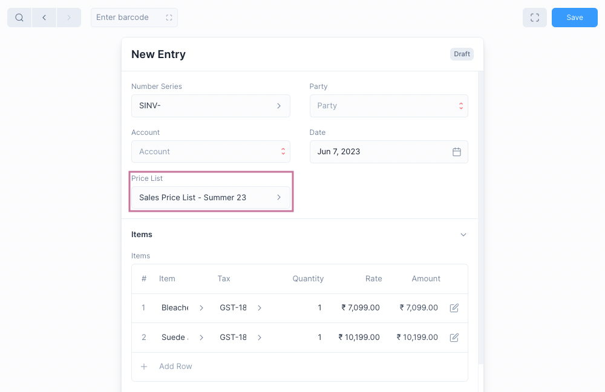

# Price List

Using Price List, you can keep track of multiple [Item Prices](#item-price-table-fields) for sales and purchase.

An Item can by priced differently depending on whether it is for sale or
purchase, if it is discount season, etc.

A Price List helps by grouping multiple item prices under a single entry. You
can then select this entry when making a Sales or a Purchase Invoice, and when
an item is selected its rate will be fetched from the Price list.

To use Price Lists you need to first enable them.

## Enable Price List

The Price List feature needs to be enabled first by checking the
**Enable Price List** option in the General Settings.

To navigate: `Setup > Settings > General Tab`

## Create a Price List

To create a Price Lists, go to:`Common > Price List`. And then click on the blue
`+` button to open a new Price List creation form.

Add Item Prices to your price list, when done click on the Save button.

Price List Fields:

1. **Is Price List Enabled**: enables the Price List, if disabled it cannot be used.
2. **For Sales**: if enabled, the Price List can be selected in Sales Invoices.
3. **For Purchases**: if enabled, the Price List can be selected in Purchase Invoices.

:::tip Multiple Prices

You can add multiple prices for an Item in the Price List. When fetching the
price from the Price List, the first Item Price with a matching Unit Type will
be selected.
:::

## Setting a Price List

To use a Price List, ou need to select **Price List** in the Sales or Purchase Invoice form.

Once this is done, when a new item is selected it's price will be fetched from
the selected Price List.
