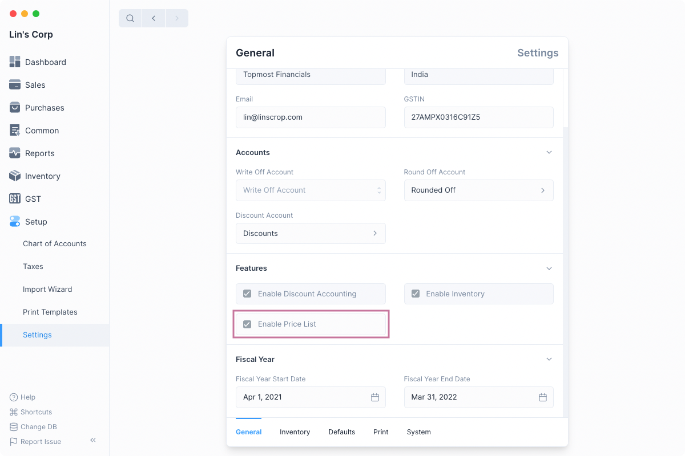

# Price List

Using Price Lists, you can keep track of multiple selling and buying 
[Item Prices](/entries/item-price).

An Item can have several pricing based on the customer, whether they are buying 
or selling, batches, and so on, and these prices can be saved in separate rate plans

To view a Price List, go to:`Common > Price List`

## Enable Price List

The Price List feature needs to be enabled first by checking the `Enable Price List` 
option in the General Settings.
To navigate: `Setup > Settings > General Tab` 

## Choosing a Price List

You need to select `Price List` in the transaction to 
have Item Price fetched in the [Sales](/transactions/sales-invoices#sales-invoices) 
or [Purchase](/transactions/purchase-invoices#creating-purchase-invoices) transaction.

## How to use a Price List

Price Lists will be used when creating [Item Prices](/entries/item-price) to keep 
track of the selling or buying price of an Item.

**Disable a Price List**: Uncheck the `Enabled` checkbox to make the selected Price List Inactive. Disabled 
Price List will not be visible in the Sales and Purchase transactions.

**Price Not UOM Dependent**: Take tomatoes as an example, which you may buy in boxes 
and sell in kilograms. 10 kilograms equal 1 box, and the cost of 1 kilogram is 10 rupees. 
If you just choose one box in your transaction and this field Price Not UOM Dependent is 
left unchecked, the price will only be displayed for a Kilo because that is the only item 
price that has been kept. Now, if you check this box and conduct a transaction with a box 
of tomatoes, the price will be set to 100 because the cost of 1 box (10 kilos) is 100.