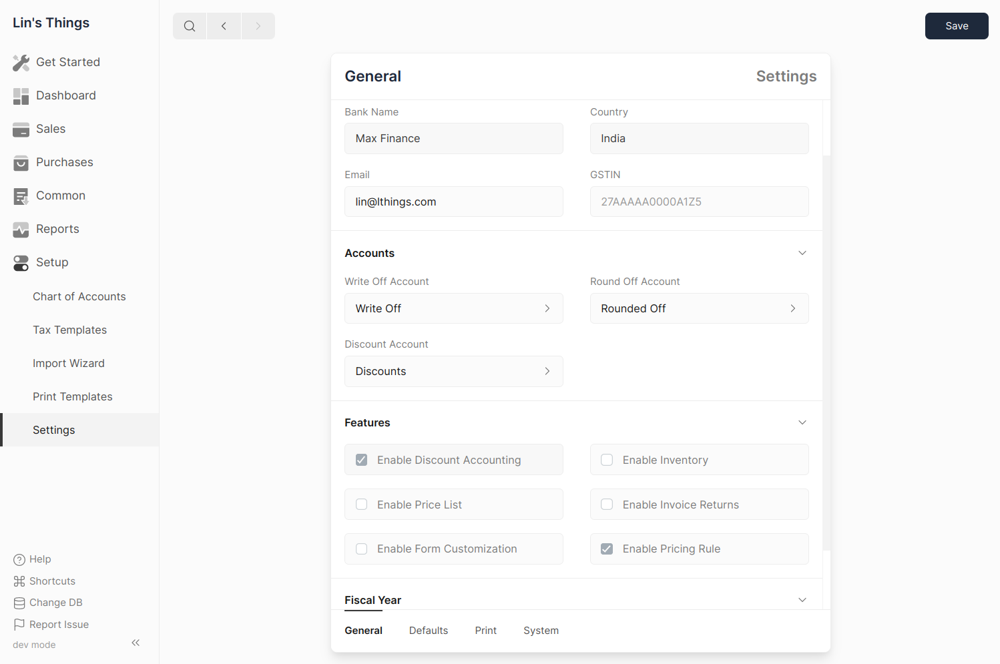
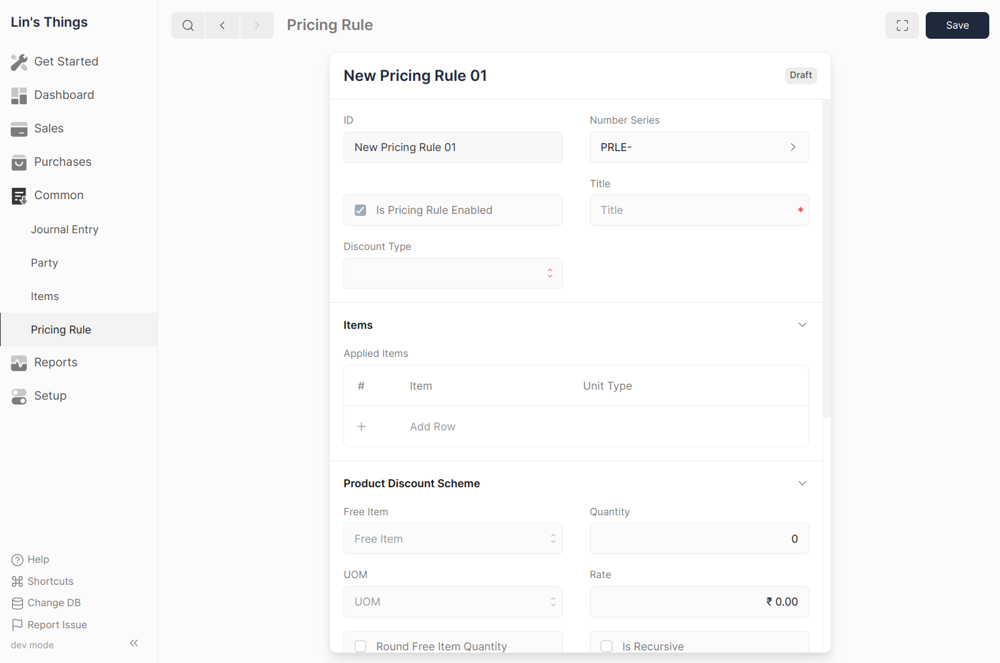

# Pricing Rule

Pricing rules allow you to offer flexible discounts and prices based on various
criteria, making your sales promotions more targeted and impactful.

**Common Use Cases:**

- **Quantity Discounts:** Offer a discount (percentage or amount) on items when
  a certain quantity is purchased (e.g., 10% off for buying 5 or more items).
- **Buy-One-Get-One (BOGO) Offers:** Give away a free item or offer a significant
  discount on a second item when a specific item is purchased.
- **Tiered Pricing:** Set different price levels for items based on the total
  order value (e.g., offer a lower price per unit when customers spend above a certain amount).
- **Early Bird Discounts:** Provide a discount for orders placed before a specific date.

## Enable Pricing Rules

1. Go to `Setup > Settings`.
2. Navigate to the **Features** section.
3. Check the boxes for the **Enable Discount Accounting** and **Enable Pricing Rule**.

## Creating a Pricing Rule

1. Go to `Common > Pricing Rule`.
2. Click the `+` button to create a new rule.

## Pricing Rule Fields

- **Is Pricing Rule Enabled:** Check this box to activate the rule.
- **Items:** Select the specific items or item groups to which the rule applies.
  Leave blank to apply to all items.
- **Price Discount Type:** Choose the type of discount you want to offer:
  - **Rate:** Set a fixed discount amount (e.g., $5 off).
  - **Discount Percentage:** Apply a percentage discount (e.g., 10% off).
  - **Discount Amount:** Offer a specific discount per unit (e.g., $1 discount per item).
- **Free Item:** Select the item you want to offer for free or at a discount.
- **Quantity:** Enter the number of free items to be given with the purchase.
- **UOM:** Specify the unit of measurement for the free item.
- **Rate:** If offering a discount on the free item, enter the discounted price.
- **Round Free Item Quantity:**
  - **Rounding Method:** Choose how to handle fractional quantities of free items:
    - **Floor:** Round down to the nearest whole number (e.g., 10.1 free items becomes 10).
    - **Round:** Round to the nearest whole number (e.g., 10.1 free items becomes 10, 10.9 becomes 11).
    - **Ceil:** Round up to the nearest whole number (e.g., 10.1 free items becomes 11).
- **Is Recursive:** Enable this option for BOGO offers where buying multiple
  qualifying items triggers the offer multiple times.
- **Recurse Every:** (Applicable only if "Is Recursive" is enabled) Set the number
  of items for which the BOGO offers repeats (e.g., buy 2, get 1 free repeat every 2 purchases).
- **Min Qty:** Minimum quantity of the specified item required to trigger the rule.
- **Max Qty:** Maximum quantity of the specified item to which the rule applies.
- **Min Amount:** Minimum order value for the rule to be applied.
- **Max Amount:** Maximum order value for the rule to be applied.
- **Valid From:** The start date for the pricing rule to be active.
- **Valid Till:** End date for the pricing rule to be inactive.
- **Priority:** Assign a number to determine the order of applying multiple pricing
  rules to the same item. The rule with the highest priority takes precedence.

## Examples

1. BOGO Offer: Buy 3 Get 1

   | Field         | Value            |
   | ------------- | ---------------- |
   | Discount Type | Product Discount |
   | Quantity      | 1                |
   | Rate          | 0                |
   | Recurse Every | 3                |

2. Buy 2 Get 10% Discount

   | Field                       | Value            |
   | --------------------------- | ---------------- |
   | Discount Type               | Price Discount   |
   | Price Discount Type         | Discount Percent |
   | Discount Percentage         | 10               |
   | Min Qty (As Per Stock Unit) | 2                |
