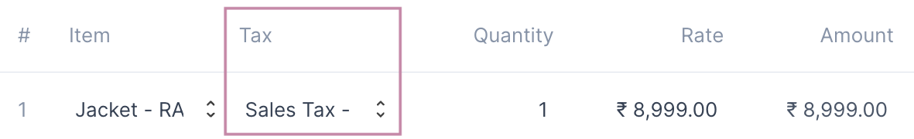

# Taxes

To calculate the amount of tax on an Item's purchase or sale, a Tax entry has to
be selected on the invoice row.

::: tip Auto Set Tax
If the Tax has been set on the Item then it will be auto set in the invoice row.
:::

Tax entries can be made from the Tax page: `Setup > Taxes`

## Tax Fields

A Tax entry has just two fields

1. Tax Name: a unique name to identify the tax by.
2. Tax Detail: a table where the Tax account along with the Tax rate is set. 

::: info Tax Detail
Tax Detail is a table as a single tax can have multiple components each with a
separate account and rate.
:::
