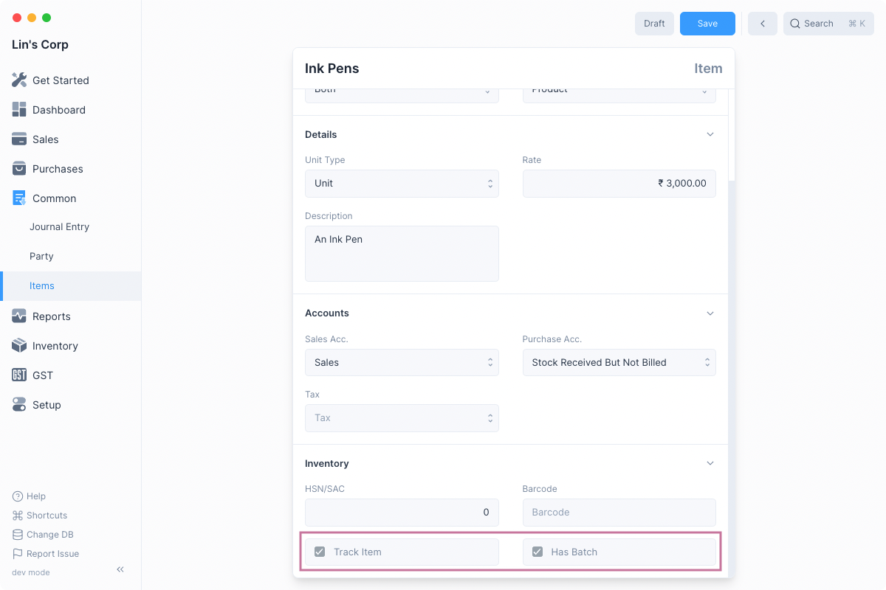
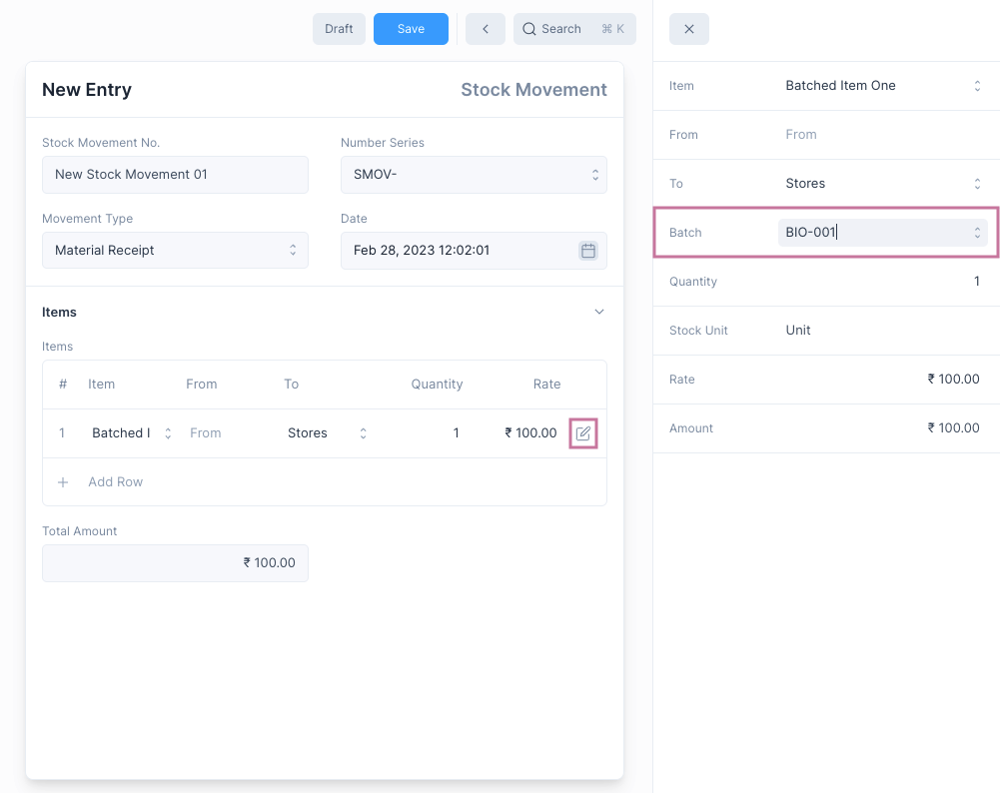
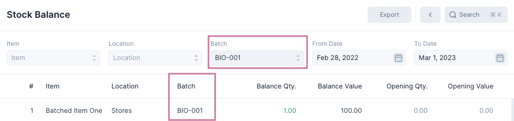

# Batches

Inventory in Frappe Books can be maintained on the basis of Batches. Here a
Batch of some Item is a uniquely grouped collection of those Items.

## Enable Batches

The Batch feature needs to be enabled first by checking the Enable Batches
option under [Inventory Settings](/inventory/settings).

To navigate to the list of Batches, open [Quick Search](/miscellaneous/search)
and then type "batch list" and select the first option.

## Batched Items

Once Batch has been enabled, you can mark an Item as a Batched Item by first
checking Track Item and then Has Batch.

::: info Track Item

Has Batch can be enabled only if Track Item is set.
:::

## Mentioning Item Batch

Once Batch has been enabled for an Item, transactions involving the item that
update inventory such as Stock Movements, Shipments and Purchase
Receipts will require mentioning the Item's Batch.

This can be done by clicking the edit button on the table row and selecting the
batch.

## Batch-wise Reports

After batches have been enabled, the inventory reports i.e. Stock Ledger and
Stock Balance will both have an additional column that mentions the Item's Batch.

You can also set Batch specific filters to show information that relates only to
the selected Batch.

