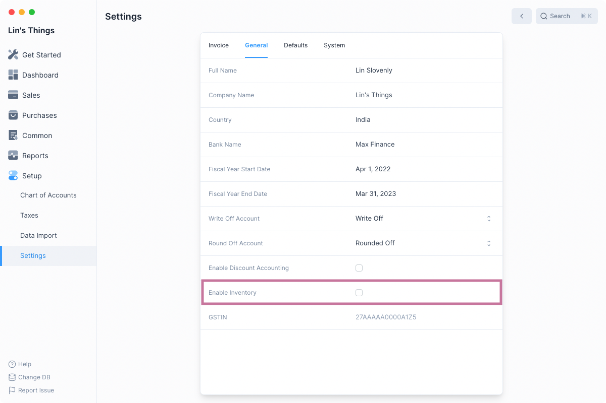
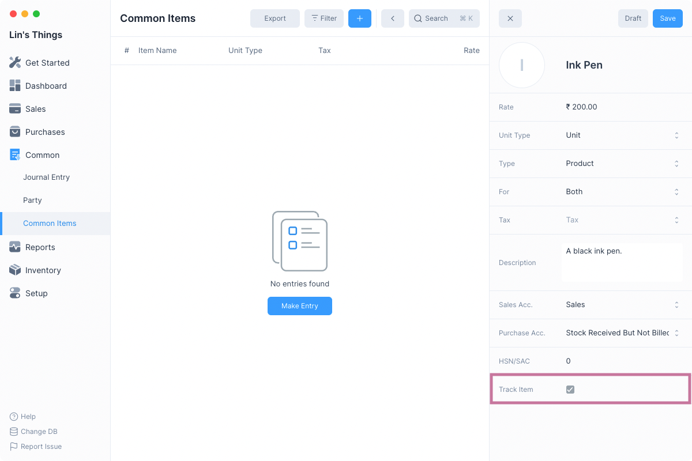

# Introduction to Inventory

Frappe Books' inventory features allows you to track the movement of your items
as you perform your business transactions.

## Inventory Features

The inventory module of Frappe Books consists of the following features:

1. [Stock Movement](/inventory/stock-movement): transaction that records the movement of Items to and from
   selected Locations.
2. [Shipment](/inventory/shipment): transaction that records the movement of Items to a Customer after
   a sale has been made.
3. [Purchase Receipt](/inventory/purchase-receipt): transaction that records the movement of Items from a
   Supplier after a purchase has been made.
4. [Stock Ledger](/inventory/stock-ledger): report that keeps a record of all the stock transactions.
5. [Stock Balance](/inventory/stock-balance): report that displays the stock balance quantities.

## Enabling Inventory

To enable inventory you will have to first check the Enable Inventory. To
navigate: `Setup > Settings > General Tab`.

Once that is done you will have to restart Frappe Books to see the Inventory
item in the sidebar.

::: warning

Inventory cannot be disabled once it has been enabled.
:::

## Tracking an Item

Since you may not want to track the movement of all items, item tracking has to
be enabled by setting the Track Item checkbox when creating an item.

::: info

Track Item can be enabled only while creating the item.
:::

Once you have created an item with tracking enabled, you can track its movement
by making inventory specific transactions.

## Location

In Frappe Books the movement of an item takes place to and from a _Location_.
There are two kinds of movements that can take place:

1. Inward movement: When you move an item to a _Location_, the quantity of the
   item at that location increases.
2. Outward movement: When you move an item from a _Location_, the quantity of the
   item at that location decreases.

The source or destination location for an outward or inward transaction is
selected when making the transaction.

::: info Default Location

Frappe Books has a default location called Stores set. This can be changed from
the Inventory tab under Settings.
:::

::: tip Creating Locations

Additional locations can be created when making an inventory transaction. To do
so click the Create option in the Location selection dropdown.
:::

## Stock Quantity

Since an outward movement reduces the stock quantity at a location, if the
location has an insufficient quantity of stock, the transaction will not be
allowed.

This means that negative stock movement will not be allowed. This applies even
to backdated entries that may cause negative stock in the future.

To enable the outward movement, two things can be done:

1. Change the location to one that has sufficient quantity.
2. Create an inward movement of the selected Item to the selected Location
   before the blocked transaction.

::: tip Stock Balance

To check which Location has sufficient quantity of an Item check the Stock
Balance report.
:::

---

Now that you know how to enable inventory and are familiar with the basic
concepts, you can move onto reading about the inventory transactions.
