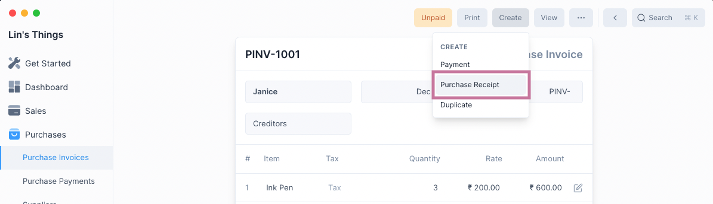
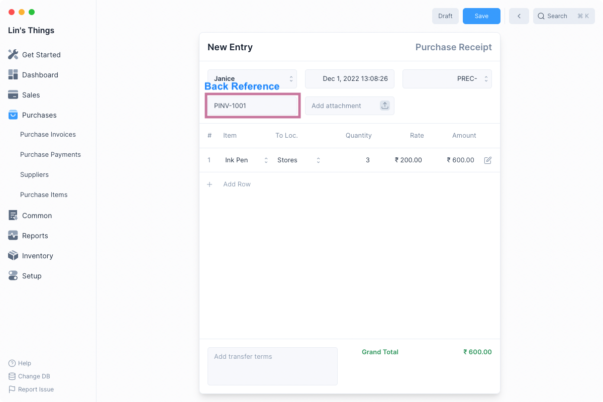
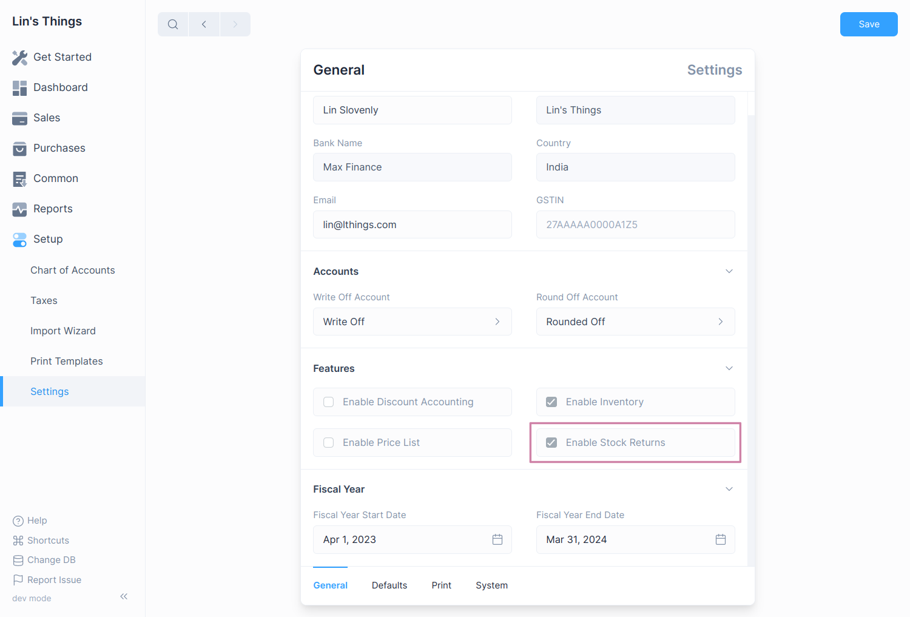
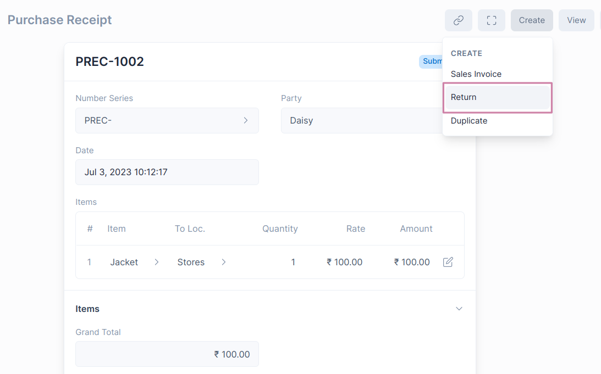
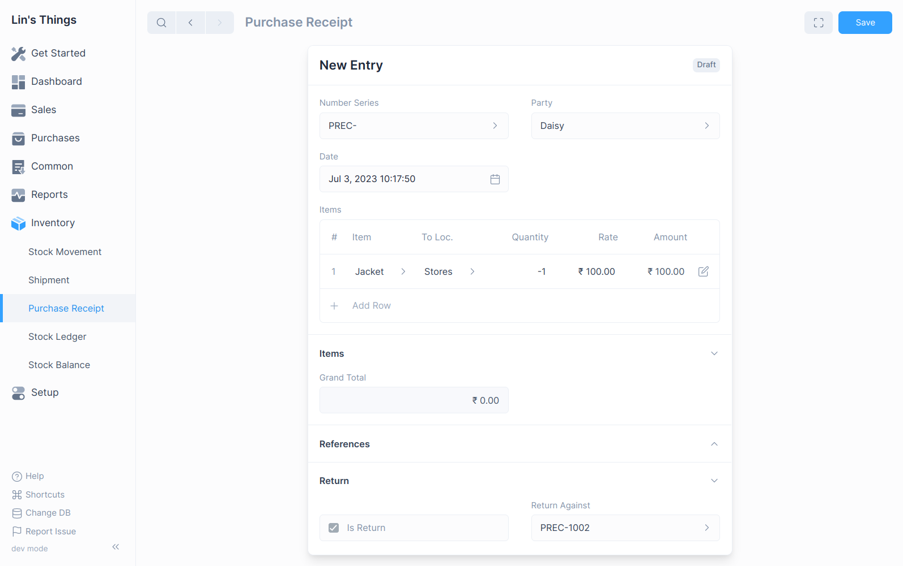
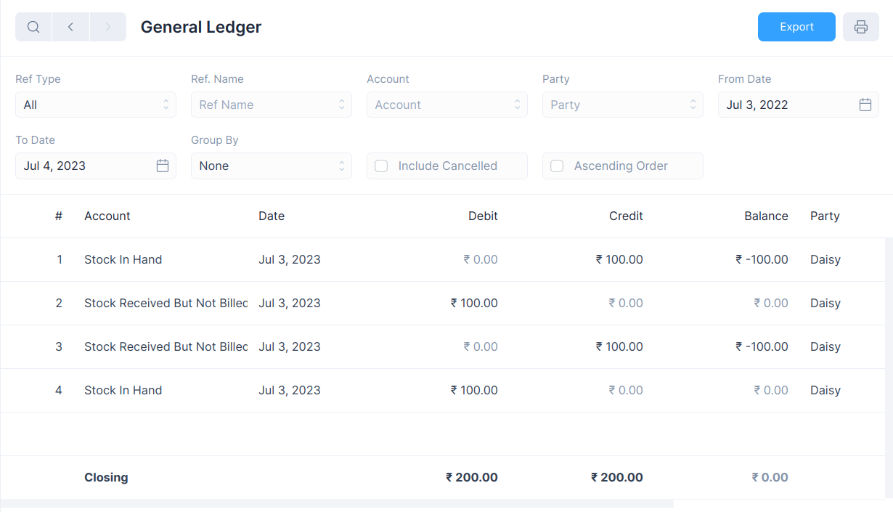
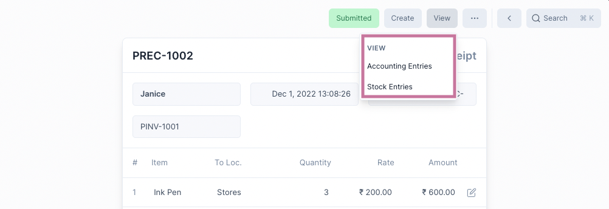

# Purchase Receipt

Purchase Receipt is an inventory transaction that records the receipt stock from a
supplier after a purchase has been made.

Purchase Receipts record inward movement of stock.

## Creating a Purchase Receipt

There are two ways to create a Purchase Receipt.

### From a Purchase Invoice

Since a receipt of stock follows a purchase, you can create a Purchase Receipt after
submitting a Purchase Invoice.

To do this select Purchase Receipt from under the Create menu button.

::: tip Back Reference

This will create a Purchase Receipt with a reference to the Purchase Invoice and allows you
to view all created Purchase Receipts from the Purchase Invoice.
:::

### From the List View

To do this first navigate to the Purchase Receipt page: `Inventory > Purchase Receipt` then
click on the blue `+` button.

The creation method is shared with with other transactional entries, for more
information check [this link](/transactions/transactional-entries.html#creating-an-entry).

::: warning No Back Reference

This method doesn't create links to any Purchase Invoices and is an isolated entry.
:::

### Purchase Receipt Form

After selecting one of the above two methods of creating a Purchase Receipt, you will
see the Purchase Receipt form.

If you created the Purchase Receipt from a Purchase Invoice, all the rows will be filled
out for you. Else you will have to enter the Purchase Receipt details.

Once the Purchase Receipt details have been entered, click on Save and then Submit to
make the Purchase Receipt entry.

A Purchase Receipt can have one of four Status:

| Status        | Description                                          |
| ------------- | ---------------------------------------------------- |
| Submitted     | Purchase Receipt Entry is Submitted                  |
| Return        | Purchase Receipt Return Entry is Submitted           |
| Return Issued | Purchase Receipt has Return Entry created against it |
| Cancelled     | Purchase Receipt Entry is cancelled                  |

## Purchase Receipt Return

The user can create a Purchase Receipt Return directly from the original Purchase
Receipt document or manually from the New Purchase Receipt Entry.

The Stock Returns feature needs to be enabled first by checking the **Enable Stock
Returns** option in the General Settings.

To navigate: `Setup > Settings > General Tab`

### Creating a Purchase Receipt Return

1. Open the original Purchase Receipt document.
2. Click on **Create > Return**.
   
3. The Party and Item details will be fetched as set in the original Purchase Receipt
   document. You can set the quantity of Items returned in negative numbers.
   
4. Save and Submit.

::: info
The Item quantity and Payment amount will be in negative figures since it's a return.
:::

## How does Purchase Receipt Return affect General Ledger

The Purchase Receipt Return will reverse the impact of the original Purchase Receipt
in the General Ledger.

## View Ledger Entries

After a Purchase Receipt is submitted, both Stock Ledger and General Ledger entries
are created.

To view these you can click on the View button and select the one you would like
to see.

