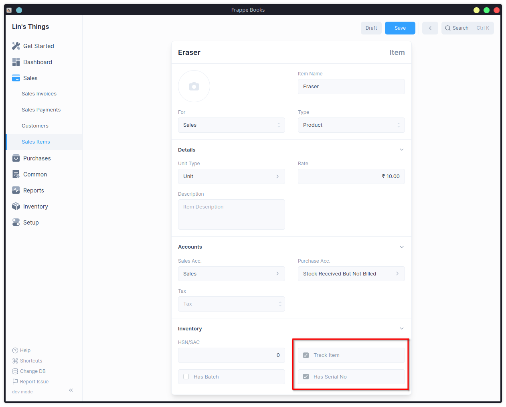
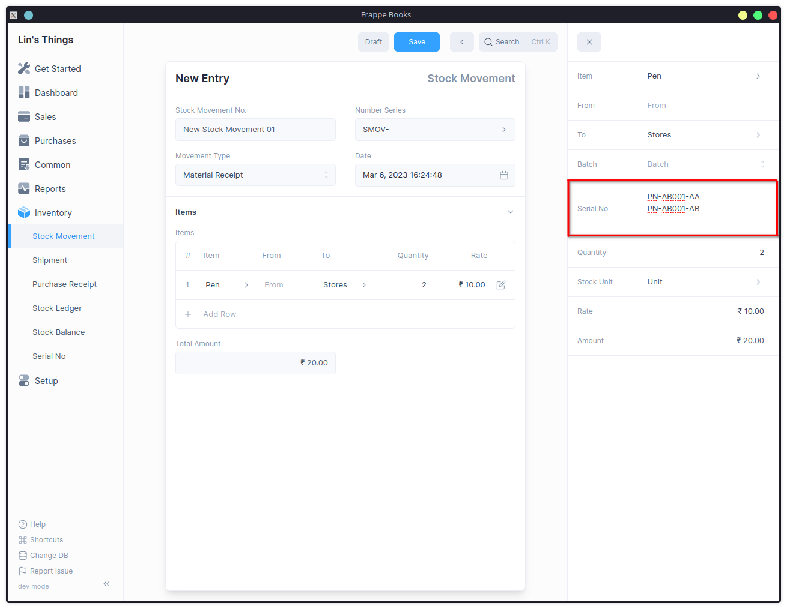

# Serial Number

With a Serial Number, you can keep track of individual serialised items.
The Serial No status will tell you its current inventory status.

## Enable Serial Number

The Serial Number feature needs to be enabled first by checking the Enable Serial No.
option under [Inventory Settings](/inventory/settings).

To access the serial number list, go to: `Inventory > Serial No.`

## Serialized Items

Once you've enabled Serial No, you can mark an item as a serialised item by
first checking `Track Item` and then `Has Serial No.`

::: info Track Item

Has Serial No. can be enabled only if Track Item is set.
:::

## Mentioning Item Serial Number

Once a Serial Number has been enabled for an item, transactions involving the item
that update inventory, such as stock movements, shipments, and purchases.

This can be done by clicking the edit button on the table row and selecting the Serial No.

::: info Serial No
If your item is serialised, you must put the Serial Number in the related
column, one per line.
:::

## Serial No Status

- Serial No Status is set based on Stock Entry.
- Serial Nos can automatically be created from a Stock Entry or Purchase
  Receipt. Serial Numbers are automatically created if you mention them in
  the Serial Nos column.
- Only Serial Numbers with status 'Active' can be delivered.
- When a Shipment mentioning the serial number is created, status of
  the serial number changes to Delivered.
