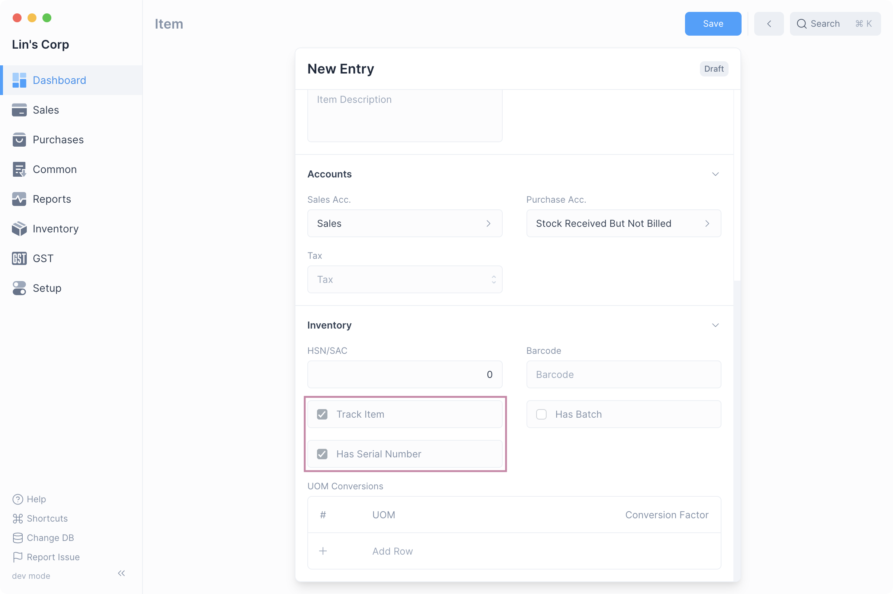
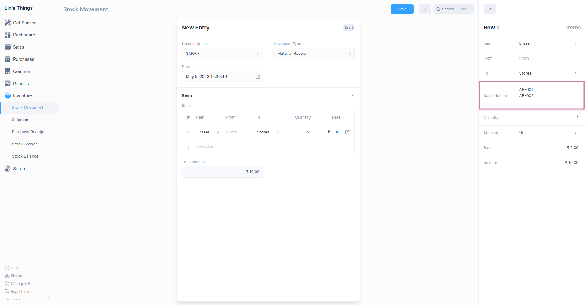

# Serial Number

if an Item is serialized, a Serial Number record is maintained for each quantity 
of that Item. This information helps to track the location of the Serial Number.
The Serial Number status will tell you its current Inventory status.

## Enable Serial Numbers

The Serial Number feature needs to be enabled first by checking the Enable Serial Number
option under [Inventory Settings](/inventory/settings)

To navigate to the list of Serial Numbers, open [Quick Search](/miscellaneous/search)
and then type "serial number list" and select the first option.

## Serialized Items

Once you've [enabled](/inventory/serial-number#enable-serial-number) Serial Number, you 
can mark an item as a serialized item by first checking `Track Item` and then 
`Has Serial Number`

::: info Track Item
`Has Serial Number` can be enabled only if `Track Item` is set.
:::

## Mentioning Item Serial Number

Once a Serial Number has been enabled for an [Item](/entries/items), transactions involving 
the Item that update Inventory, such as Stock Movements, Shipments, and Purchases, must 
include the Serial Number. 

This can be done by clicking the edit button on the table row and entering the Serial Number 
one per quantity.

::: info Serial Number
For each 'quantity' of a serialized Item a single Serial Number should be provided.
:::

## Serial Number Status

- Serial Number status is set based on its Inventory transactions.
- Serial Numbers can be automatically created from a Material Receipt or Purchase
  Receipt if you mention them in the Serial Numbers column.
- Only Serial Numbers with status `Active` can be delivered.
- When a Shipment or Material Issue mentioning the Serial Number is created, status of
  the Serial Number changes to `Delivered`.
