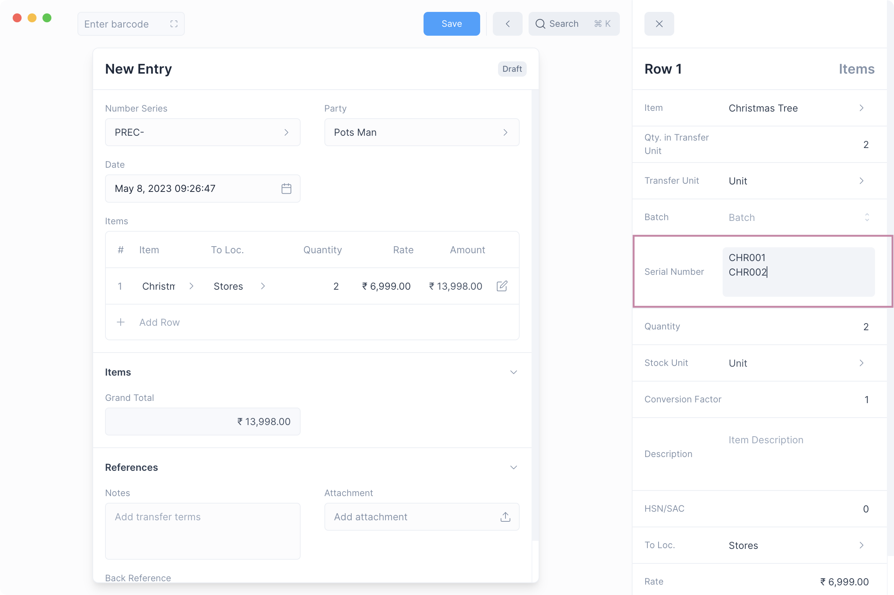

# Serial Number

If an Item is serialized, a Serial Number record is maintained for each unit of
quantity of that Item. This information helps to track the location of the
Serial Number. The Serial Number status will tell you its current Inventory
status.

## Enable Serial Numbers

The Serial Number feature needs to be enabled first by checking the Enable Serial Number
option under [Inventory Settings](/inventory/settings)

To navigate to the list of Serial Numbers, open [Quick Search](/miscellaneous/search)
and then type "serial number list" and select the first option.

## Serialized Items

Once you've [enabled](/inventory/serial-number#enable-serial-number) Serial Number, you
can mark an item as a serialized item by first checking **Track Item** and then
**Has Serial Number**

::: info Track Item
**Has Serial Number** can be enabled only if **Track Item** is set.
:::

## Mentioning Item Serial Number

Once a Serial Number has been enabled for an [Item](/entries/items), transactions involving
the Item that update Inventory (such as Stock Movements, Shipments, and Purchases) must
include the Serial Number.

This can be done by clicking the edit button on the table row and entering the Serial Number
one per quantity.

::: info Serial Number Entry
For each unit of quantity of a serialized Item a single Serial Number should be
provided on a separate line.
:::

## Serial Number Status

The status of a Serial Number changes depending on whether the transaction is an
inward transaction (eg Purchase Receipt), or an
outward transaction (eg Shipment).

A Serial Number can have one of three Status:

| Status    | Description                                                                 |
| --------- | --------------------------------------------------------------------------- |
| Active    | Serial Number is in stock and can be used only for outward transactions.    |
| Inactive  | Serial Number is not in stock and can be used only for inward transactions. |
| Delivered | Serial Number has been used for an outward transaction and cannot be used.  |

Here is a table that shows how the status of a Serial Number changes:

| Status Change      | Transaction                                                                                     |
| ------------------ | ----------------------------------------------------------------------------------------------- |
| Inactive → Active  | Inward transactions: Material Receipt or Manufacture (created) Stock Movement, Purchase Receipt |
| Active → Delivered | Outward transactions: Material Issue or Manufacture (used up) Stock Movement, Shipment          |

If a transaction is cancelled then the Serial Number status is reverted.
