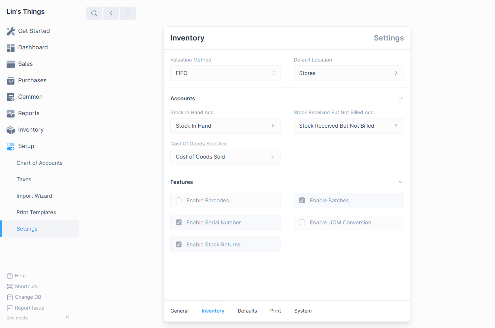

# Inventory Settings

Inventory settings will allow you to configure the inventory module to your
requirements. To navigate to Inventory Settings: `Setup > Settings` then click
on the Inventory tab

## Setting Items

The following values can be configured

### Valuation Method

This can be used to select either FIFO or Moving Average valuation methods.

The valuation rate displayed in the Stock Ledger or the Stock Balance report is
calculated on the basis of the Valuation Method selected.

### Default Location

This is used to set the location that is used whenever an inventory transaction
detail is created.

### Stock In Hand Account

This is used to set the default Stock In Hand Account that is debited whenever
stock is received.

### Stock Received But Not Billed Account

This is used to set the default Stock Received But Not Billed Account that is
debited on making a Purchase Invoice for a tracked item, and credited when a
Purchase Receipt is made.

### Cost Of Goods Sold Account

This is used to set the default Cost of Goods Sold Account that is debited
whenever a Shipment is made.

### Enable Barcodes

Checking this will allow you to set barcodes on items. It will also display a
barcode input in forms (such as Sales Invoice and Shipment) where items are
entered.

### Enable Batches

Checking this will allow the usage of Batches. Items will have a Has Batch
option if the item is being tracked. It will also enable the Batch entry type
which can be navigated to by using the Quick Search.

### Enable Serial Numbers

Checking this will allow the usage of Serial Numbers. Items will have a Has 
Serial Number option if the item is being tracked.

### Enable UOM Conversion

Checking this will allow setting multiple UOMs for an Items. Then when making a
entry that involves the Item, one of the other UOMs can be selected to mention
its quantity.
