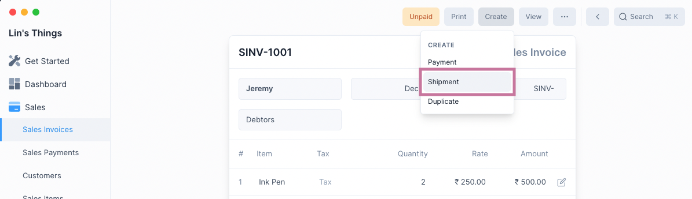
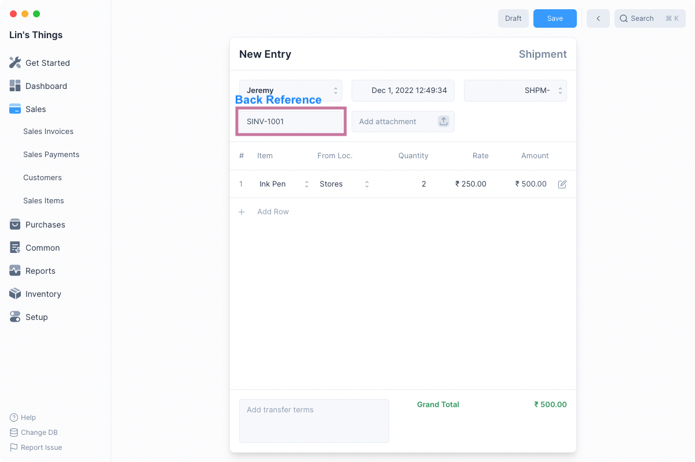
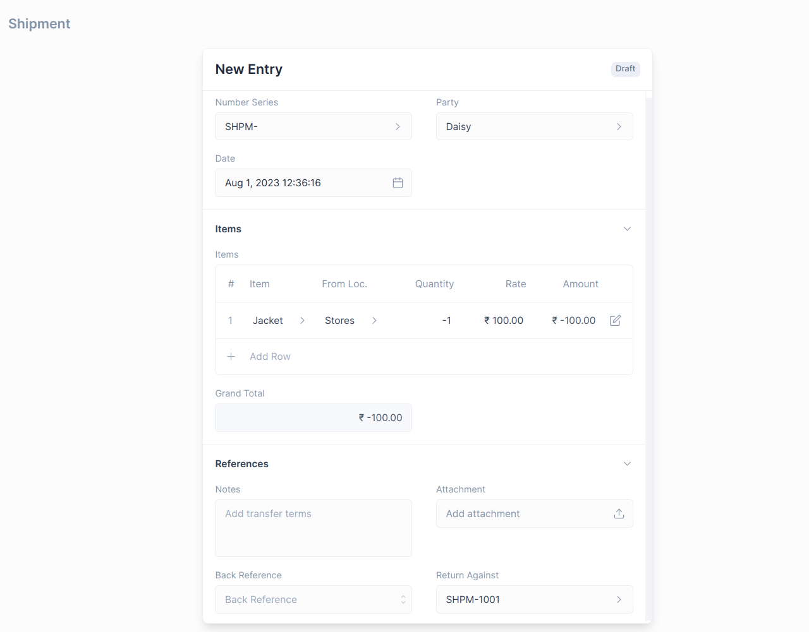
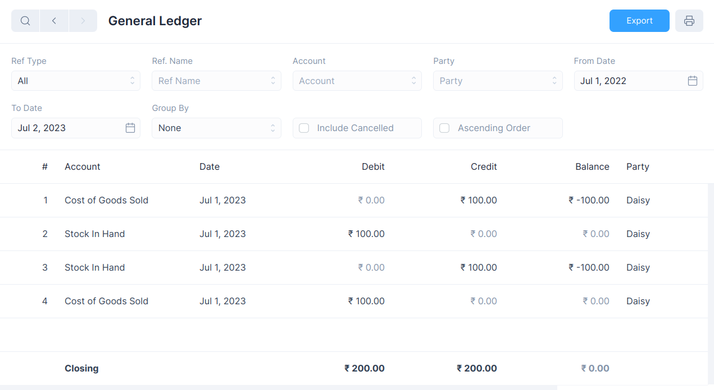

# Shipment

Shipment is an inventory transaction that records the delivery of stock to a
customer after a sale has been made.

Shipments record outward movement of stock. Hence a shipment can take place only
if there is sufficient quantity of an Item at the selected Location.

## Creating a Shipment

There are two ways to create a Shipment.

### From a Sales Invoice

Since a shipment of stock follows a sale, you can create a Shipment after
submitting a Sales Invoice.

To do this select Shipment from under the Create menu button.

::: tip Back Reference

This will create a Shipment with a reference to the Sales Invoice and allows you
to view all created Shipments from the Sales Invoice.
:::

### From the List View

To do this first navigate to the Shipment page: `Inventory > Shipment` then
click on the blue `+` button.

The creation method is shared with with other transactional entries, for more
information check [this link](/transactions/transactional-entries.html#creating-an-entry).

::: warning No Back Reference

This method doesn't create links to any Sales Invoices and is an isolated entry.
:::

### Shipment Form

After selecting one of the above two methods of creating a Shipment, you will
see the Shipment form.

If you created the Shipment from a Sales Invoice, all the rows will be filled
out for you. Else you will have to enter the Shipment details.

Once the Shipment details have been entered, click on Save and then Submit to
make the Shipment entry.

## Shipment Return

The customer could return an already sold Item due to quality issues, non-delivery
on the agreed date, or any other reason. The user can create a Shipment Return
directly from the original Shipment document or manually from the New Shipment Entry.

### Creating a Shipment Return

1. Open the original Shipment document, against which customer returned the Items.
2. Click on **Create > Sales Return**.
   
3. The Party and Item details will be fetched as set in the original Shipment document.
   You can set the quantity of Items returned in negative numbers.
   
4. Save and Submit

::: info
The Item quantity and Payment amount will be in negative figures since it's a return.
:::

### Creating Manually

1. Navigate to the Shipment page `Inventory > Shipment`
2. Check `isReturn` to mark the Shipment as Return. If you want to reference an original
   Shipment, click on `Return Against` then select the target Shipment.
   
3. Fill Item details.
4. Save and Submit.

## How does Shipment Return affect General Ledger

The Shipment Return will reverse the impact of the original Shipment in the General Ledger.

## View Ledger Entries

After a Shipment is submitted, both Stock Ledger and General Ledger entries are
created.

To view these you can click on the View button and select the one you would like
to see.

