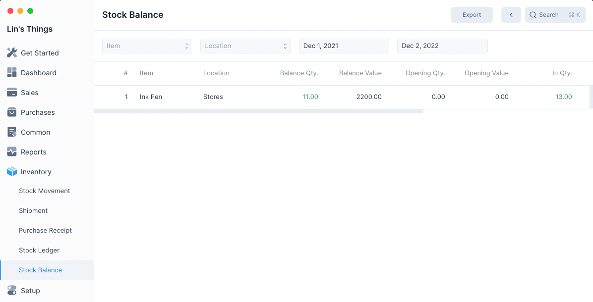

# Stock Balance

Stock Balance is a report that displays the current stock quantities, value and
valuation rate by Item and Location.

## Filters

The Stock Balance has filters which can help you narrow the generated report to
the entries you would like to see.

### Item

Selecting a Item will display only entries involving the selected item.

### Location

Selecting a Location will display only entries involving the selected location.

### From Date

The date from which all the stock balance is calculated. The default value is
one year before tomorrow.

Stock balance from before this date is used to set the Opening Quantity and
Opening Value.

### To Date

The date until which all the stock balance is calculated. The default
value is one day after today.

Values after this date are ignored.

::: tip

If you are getting insufficient quantity for backdated inventory entries, you
can use this filter to identify future negative quantity.
:::
