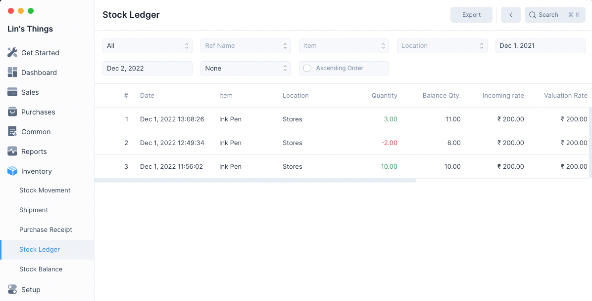

# Stock Ledger

Stock Ledger is a report that displays all the stock entries that are
recorded whenever an inventory transaction such as a Shipment or a Stock
Movement is submitted.

The Stock Ledger shows you the change in quantity, value and valuation rate over
the course of various inventory transactions.

## Filters

The Stock Ledger has several filters which can help you narrow the generated
report to the entries you would like to see.

### Ref Type

Setting Ref Type as anything other than All will display entries only of that
Transactional entry type.

Example setting Ref Type as Shipment will display only entries created due
to Shipment.

### Ref Name

Ref Name filter allows to display all ledger entries that were generated due to a
single Transactional Entry.

To enable this you need to first set Ref Type.

### Item

Selecting a Item will display only entries involving the selected item.

### Location

Selecting a Location will display only entries involving the selected location.

### From Date

The initial date after which all the entries are to be displayed. The default
value is one year before tomorrow.

### To Date

The final date before which all the entries are to be displayed. The default
value is one day after today.

### Group By

Selecting a Group By option other than None groups the entry according to the
selected option.

For instance setting Group By as Reference will group the entries by the Name of
the Transactional entry.

### Ascending Order

By default the entries are displayed by newest entry first, i.e. descending
order of Date.

Checking this will display the entries in ascending order of entry date.
