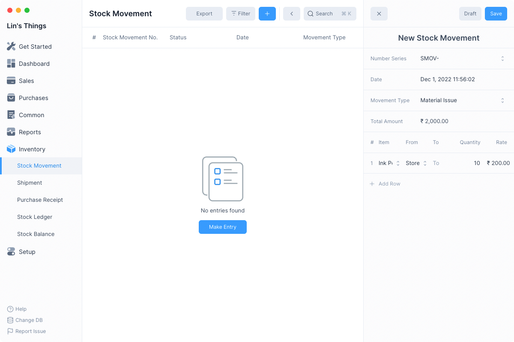
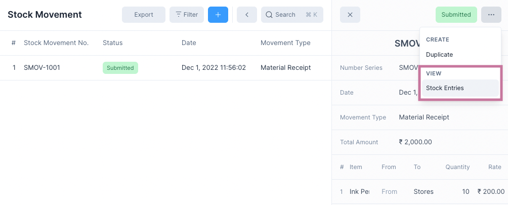

# Stock Movement

Stock Movement is an inventory transaction that records the movement of stock to
and from a location.

Unlike the other inventory transactions, stock movement is not linked to a
Customer or a Supplier through a Sale or a Purchase.

## Movement Types

Before creating a Stock Movement you need to know about its Movement Types.
There are three types of Stock Movements that you can create:

1. Material Issue: stock is moved out of a location.
2. Material Receipt: stock is moved into a location.
3. Material Transfer: stock is moved from one location to another.
4. Manufacture: stock of items are moved out of a location and stock of different items are moved into a location.

Depending on the Movement Type you have to set the From and To movement locations

| Movement Type     | From      | To        |
| ----------------- | --------- | --------- |
| Material Issue    | `set`     | `not set` |
| Material Receipt  | `not set` | `set`     |
| Material Transfer | `set`     | `set`     |
| Manufacture       | `set`     | `set`     |

::: tip Manufacture
For the Manufacture type, both From and To are set but for **different items**.

This reflects the stock movements of a manufacturing process where a set of raw
materials are converted into finished goods.

The inventory quantities of the raw material will go down and that of the
finished goods will go up.
:::

## Creating Stock Movements

To create a Stock Movement, first navigate to the stock movement List View:
`Inventory > Stock Movement` then click on the blue `+` button in the title bar.

After clicking the blue `+` button:

1. Select the Movement Type
2. Add a row by clicking on Add Row
3. Select an Item
4. Select the movement locations
5. Set the quantity and rate
6. Click on Save and then on Submit

After clicking on submit the Stock Movement entry will be recorded.

## View Stock Entries

New entries will be created in the Stock Ledger and the Stock Balance will be
updated.

To View the Stock Ledger entries click on Stock Entries under the `...` menu

