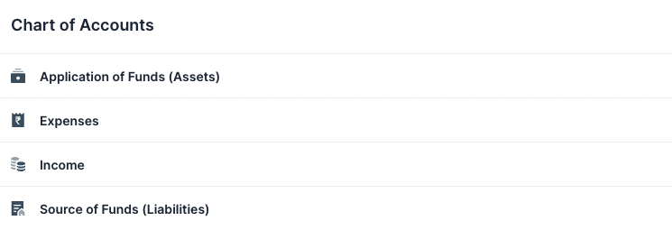
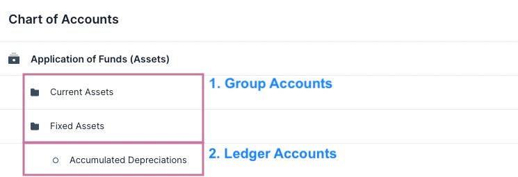
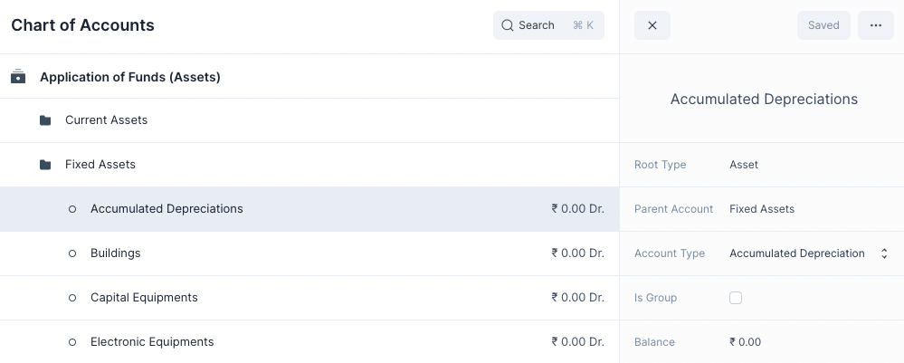

# Chart of Accounts

Chart of Accounts is used to refer to the organization of all accounts in a
financial system.

Navigate to the chart of accounts from the Sidebar: `Setup > Chart of Accounts`

## Organization of Accounts

There are two types of accounts in the Chart of Accounts
1. **Ledger Accounts**: Accounts that are used in the transactional entries and that
   appear in the General Ledger.
2. **Group Accounts**: Accounts that are used to group other Group and Ledger
   accounts.

### Root Accounts

At the upper most level there are 4 Group Accounts. These can be thought of as
the _Root Accounts_. These _Root Accounts_ have all the other accounts grouped
underneath them.

::: info Number of Root Accounts
The number of Root Accounts depends on your country's CoA. 

For example: The Indian CoA has only 4. Whereas the Standard Chart of Accounts
has 5.
:::

Each Root Account is either a Credit or a Debit account. If a Root Account is a
Credit account all the accounts underneath it will also be a Credit Account.
([Credit and Debit](/basics/accounting-basics#credit-and-debit))

### Other Accounts

Clicking on a Root Account will reveal the accounts other it. This goes for the
other Group Accounts too.

Clicking on a Ledger Account will open that accounts Quick Edit Form where the
details of the account can be viewed.

## Creating a New Account

To create a new account
1. Hover over a Group Account
2. Click on Add Account or Add Group

This will display a new row where you can enter the account name. After you are
done press Save to create the account.