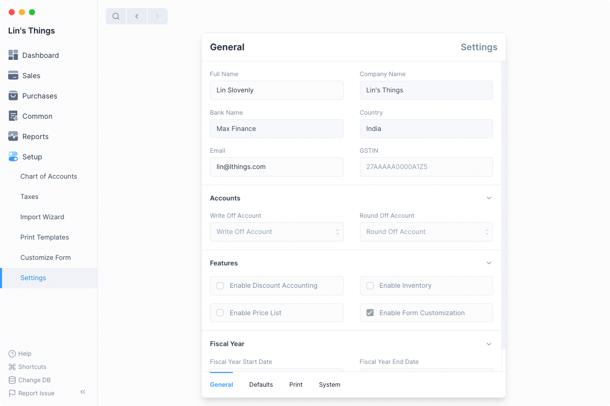
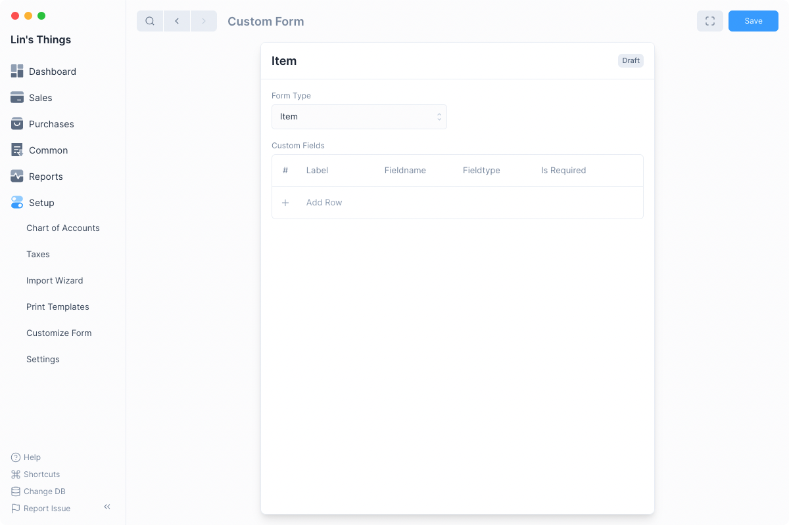
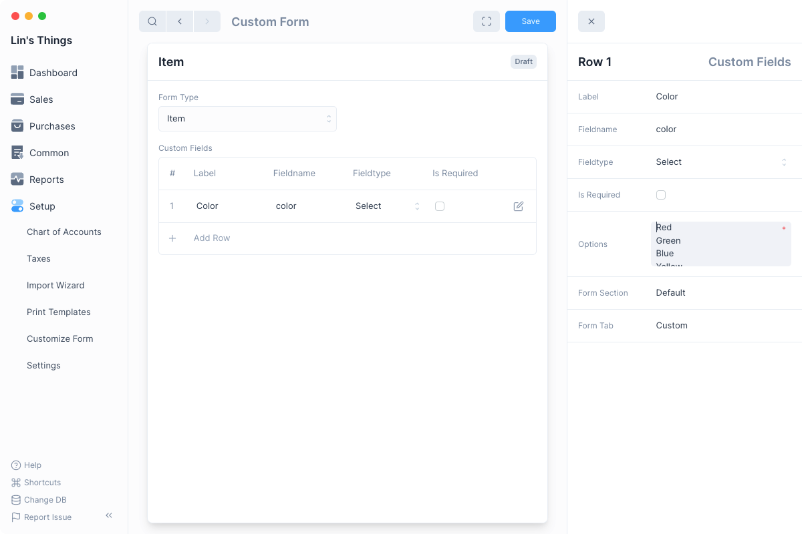
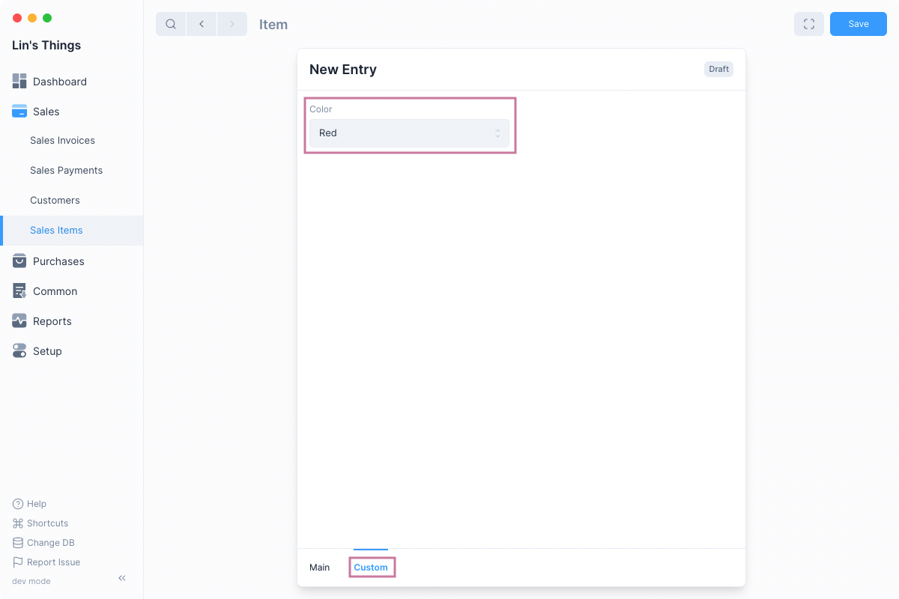
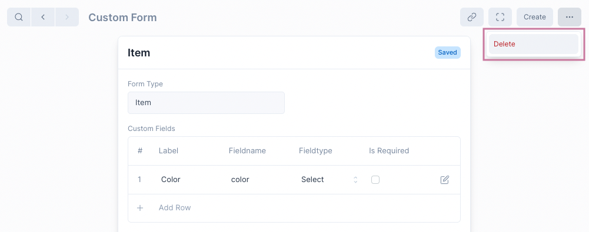

# Customize Form

Frappe Books allows you to customize all forms whether it's Invoice, or Party,
or Item you can use the Customize Form feature to add additional fields to it.

## Enable Form Customization

To be able to customize a form you need to enable it from the General Settings.

`Setup > Settings > General`

After you have navigated to the General Settings tab, click on the Enable Form
Customization checkbox.

You will have to reload Frappe Books to see the option, you can press
`Ctrl + R` if you are on Windows or linux, or `command + R` on macOS.

::: warning Disabling Form Customization

Disabling Form Customization will just hide the form customization option from
the sidebar and search, it will not disable the customizations.
:::

## Customizing Forms

After enabling form customization and reloading Frappe Books navigate to the
Customize Form list view using the sidebar.

`Setup > Customize Form`

After that click on the blue `+` button to customize a form type. This will open
a new Custom Form entry.

Select a Form Type to customize.

::: info Form Type

Form Type refers to the form that you want to add fields to such as Item, Party,
Sales Invoice, etc.

Each Form Type can have only one Custom Form entry associated with it.
:::

Once you select the Form Type you can add Custom Fields

## Custom Fields

Each Form Type can have multiple custom fields. Click on the Add Row button to
add a new Custom Field.

Enter its Label, for example if we want to add a color field to Item, we will
set the Label as "Color".

:::tip Fieldname

Setting the Label will auto set the Fieldname value. The Fieldname is a name
used to refer to the field internally.
:::

After setting the Label and the Fieldname, you can select the fieldtype, for
more information on fieldtype and the other fields that you can set for each
Custom Field row check the sections below.

Once you are done click on the blue Save button.

:::warning Reload App

After customizing a form you must reload Frappe Books to view the added fields
in the forms.
:::

After reloading the app, you will see the new fields in the form.

## Custom Field Fieldtypes

Custom Forms support 16 different Fieldtypes, each field type defines the
behavior and UI of the field.

For some fields you will have to enter additional details, here's a table the
describes the different Fieldtypes.

| Fieldtype    | Description                                                                               | Example                         | Additional |
| ------------ | ----------------------------------------------------------------------------------------- | ------------------------------- | ---------- |
| Data         | Field used for regular text input.                                                        | Full Name in Customer           | -          |
| Text         | Field with larger area of input for longer text.                                          | Notes in Sales Invoice          | -          |
| Date         | Field used to input only date.                                                            | Date in Sales Invoice           | -          |
| Date Time    | Field used to input date and time.                                                        | Date in Stock Movement          | -          |
| Int          | Field used to input integer such as -1, 0, 3, etc.                                        | HSN/SAC Code in Item            | -          |
| Float        | Field used to input fractional numbers such as 0.12, -9.33, 100.1, etc.                   | Quantity in Sales Invoice Item  | -          |
| Currency     | Field used to input monetary amounts.                                                     | Amount in Sales Invoice Item    | -          |
| Check        | Field used to display a checkbox.                                                         | Track Item in Item              | -          |
| Select       | Field used to select an item from multiple choices. Requires Options value to be set      | Entry Type in Journal Entry     | Options    |
| Autocomplete | Same as Select but with autocomplete. Used for larger number of options.                  | Country in Address              | Options    |
| Color        | Field used to select a color. Can set options to select color from.                       | Color in Print Settings         | Options    |
| Link         | Field used to mention links to other entries. Requires Target to be set.                  | Customer in Sales Invoice       | Target     |
| Dynamic Link | Field used to mention links depending on a dynamic target. Requires References to be set. | Name in Payment Reference       | References |
| Attach Image | Field used to select an image.                                                            | Image in Item                   | -          |
| Attachment   | Field used to select any type of file.                                                    | Add Attachment in Sales Invoice | -          |
| Table        | Field used to display a Table. This is currently not supported.                           | Items in Sales Invoice          | Target     |

## Other Custom Form Fields

Fields that describe behaviour:

- **Is Required**: Whether this field is required for a form to be saved.
- **Options**: New line separated list of options required by Select and Autocomplete and used by Color.
- **Target**: Form type from which Link field value is selected. If Table then the name of the Table form type.
- **References**: Fieldname of the reference field which sets the Dynamic Link target type. Eg Type in Payment Reference.

Fields that describe UI:

- **Form Tab**: Tab on the form under which the field is displayed.
- **Form Section**: Section under the entered tab where the field is displayed.

## Deleting Customizations

You can delete a forms customizations by deleting its Custom Form entry:

:::danger Data Loss

Deleting customizations will also delete data that had been stored in the custom
fields.
:::
