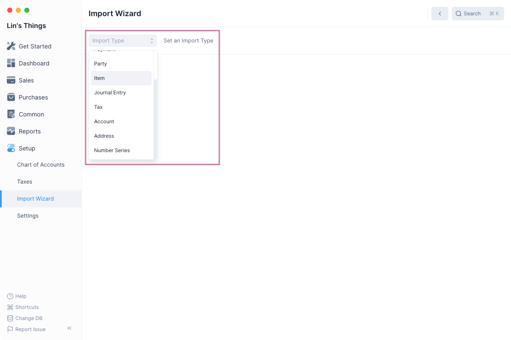
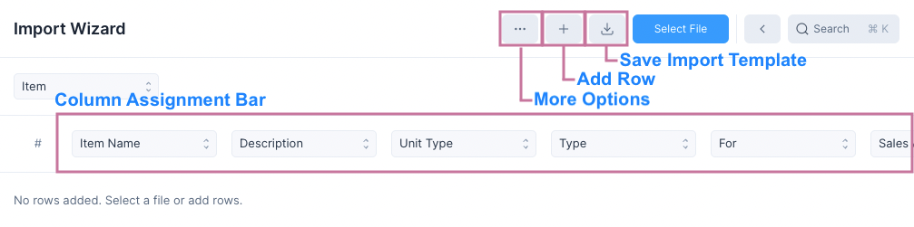
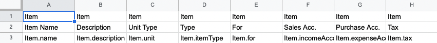
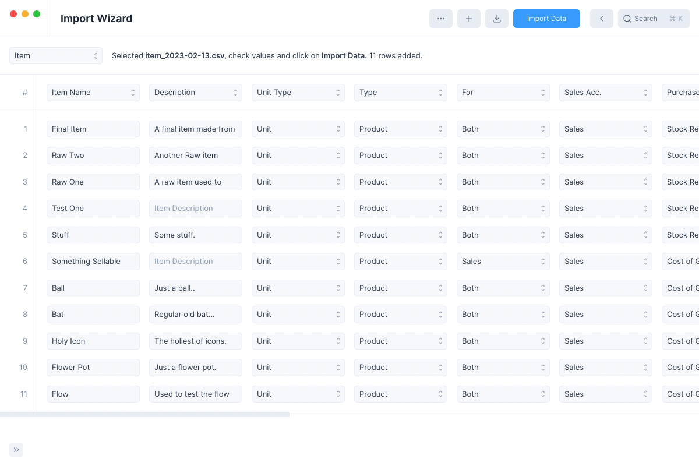
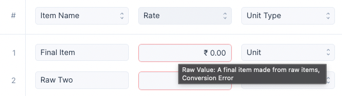
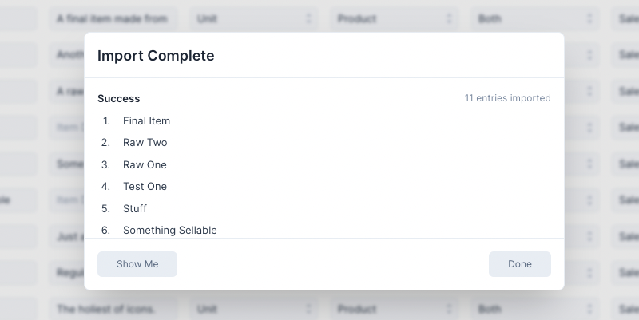
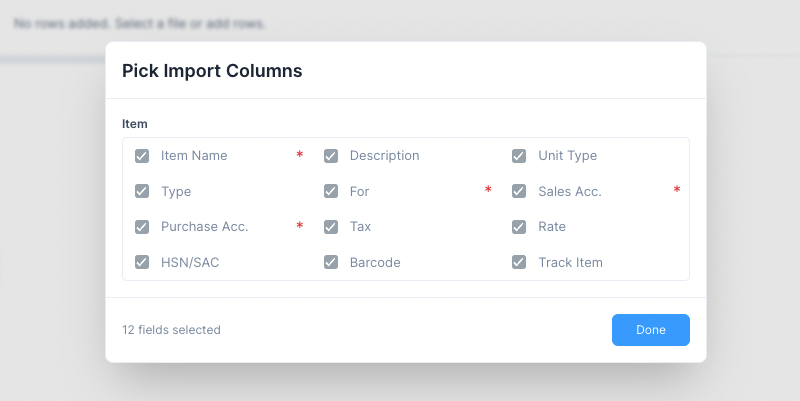
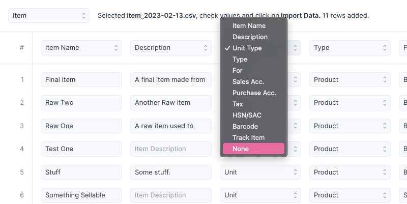

# Import Wizard

The Import Wizard is a powerful tool that can allow you to:

1. Import Data from a `.csv` file
2. Make multiple entries quickly

## Basics

To use the Import Wizard navigate to it using the sidebar:
`Setup > Import Wizard`.
Or alternatively the Quick Search, type "Import Wizard" and hit enter.

### The Interface

Once the Import Wizard has been opened you will have to select and Import Type
which decides the kind of entries to be imported.

After selecting the import type, you'll see the additional controls that are now available.

### Using a Template

To import data you, it needs to fit some template for this, first click on the
Save Import Template button.

This will download a `.csv` template file.

:::tip The Template.csv file
The Template.csv file can be filled using any spreadsheet software.

The Import Template has three rows:

1. Entry type row: Some entries have child tables and this indicates whether the
   column belongs to the child table.
2. Field label row: This tells us which field of the entry (or its child table)
   does the column belong to.
3. Field key row: This row allows the Import Wizard to auto assign the columns
   when the file is selected. If this row is not present then Column Assignment
   Bar can be used to assign the fields.

:::

To use the Template.csv file you must

1. Import it into your spreadsheet software of choice
2. Enter the values in the spreadsheet cells
3. Export the sheet as a `.csv` file

Once you have exported the `.csv` file, click on Select File to select the file.
The Import Wizard will read the file and add rows to the table.

### Verifying and Importing

You can now check the imported values and if everything seems right. If you want
to remove a row, click on the row index to delete it.

:::tip The Add Row button
You can click on the Add Row button to add an additional empty row to the bottom
of the import table which can be edited to enter the required values.

This feature can be used for making multiple entries quickly without even
selecting a file.
:::

:::info Fixing Conversion Errors
If the Import Wizard couldn't convert a value then it will be marked with a red border.

You can hover over the field to view what the raw value was and fix the value to
remove the error
:::

Finally if everything is fine, click on Import Data to begin importing the data.

### After Importing

Once import is done, you'll see the Import Complete modal

Clicking on Show Me will take you to the List View of the newly created entries.
Clicking on Done will reset the Import Wizard allowing you to make more entries.

:::info Fixing Failed Imports
If certain entries could not be imported then you can click on the Fix Failed
button that is visible only on failed imports.

Clicking it will clear all the successful imports and allow you to fix the
failed ones and retry.
:::

## Picking Import Columns

You can pick the specific columns you want to import by clicking on the `...` button
and then clicking on `Pick Import Columns`.

This will open the Pick Import Columns modal

The fields marked by the red `*` are required fields and cannot be unselected.
Other than these you can choose to keep or remove the rest of the columns.

Removing a column will:

1. Remove it from the exported template.
2. Prevent it from being assigned to a column.

## Column Assignment Bar

The Column Assignment Bar is used to mark a column in the table as a certain
field. This is useful if the file you have selected doesn't use the Import
Wizard's template.

Along with assigning columns you can even de-assign columns by selecting None

If None is selected then that column is ignored while importing data.

## Importing Entries with Child Tables

Sales Invoice is an example of an entry with a child table. Here child table
refers to the items table which lists all the items included in the sale.

When importing entry with a child table:

1. Unique placeholder names should be provided even if the entry uses a Number Series.
2. Each row in the child table should be one row.
3. All rows of an entry should have the same non child table row data.

For Example

| Invoice Name | Customer | Item (Table Row) | Amount (Table Row) |
| ------------ | -------- | ---------------- | ------------------ |
| A            | Lin      | Bat              | 100                |
| A            | Lin      | Ball             | 50                 |
| B            | Andy     | Pen              | 200                |
| B            | Andy     | Pencil           | 10                 |
| B            | Andy     | Ink              | 80                 |

Here the import table has two Sales Invoices with unique names A, and B.

Invoice A has two items and Invoice B has three items. Each item is a single row
in the import table.

And for every child table row in the import table the non child table data, i.e.
Invoice Name and Customer are repeated.

::: warning
Not following these guidelines may either cause the data to not be imported
properly or to fail altogether.
:::