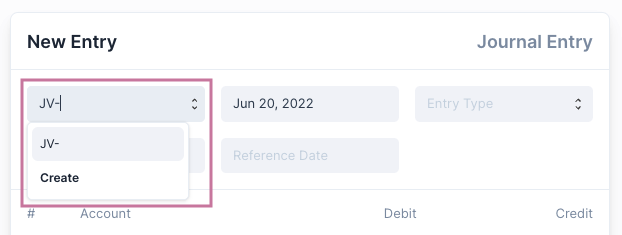
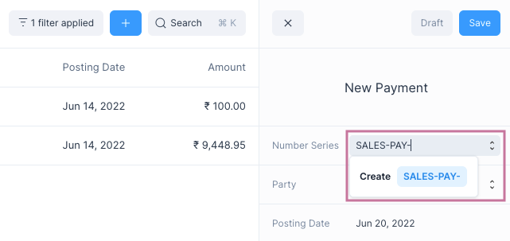
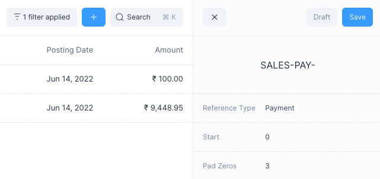

# Number Series

Number Series is used as the naming scheme for
[transactional entries](/transactions/transactional-entries). Multiple
transactions of a single type for example Journal Entry can be grouped under a
single Number Series.

## Default Number Series

By default Frappe Books comes with a single Number Series for each of the
transactional entry types

| Type             | Number Series |
| ---------------- | ------------- |
| Sales Invoice    | SINV-         |
| Purchase Invoice | PINV-         |
| Payment          | PAY-          |
| Journal Entry    | JE-           |

These are selected by default when making a transactional entry. You can create
new a Number Series to suit your needs.

::: warning
The Number Series of a transactional entry cannot be changed once Save is
clicked.
:::

## Creating a New Number Series

To create a new Number Series for a specific transactional entry

1. Find the Number Series field on the entry form or the Quick Edit Form.
2. Enter the new Number Series you would like to use in the field.
3. Click on Create

This will take you to the Number Series Quick Edit Form where you can change the
number series configuration.

Once you are done editing, click on Save, now you can use the new
Number Series for the entry.

## Number Series Fields

The fields decide how the Number Series is set

1. Prefix: The base prefix applied to the number series for example: _SINV-_
2. Reference Type: The transactional entry type to which this Number Series belongs.
3. Start: The number given to the first entry in the Number Series.
4. Pad Zeros: The number of given as padding to the number part of the Number Series.

For example, if Name is _SALES-PAY-_, Start is 0, and Pad Zeros is 3, then the
Number Series values assigned to the transactional entries would be:

_SALES-PAY-000_, _SALES-PAY-001_, _SALES-PAY-002_, _SALES-PAY-003_, etc.
