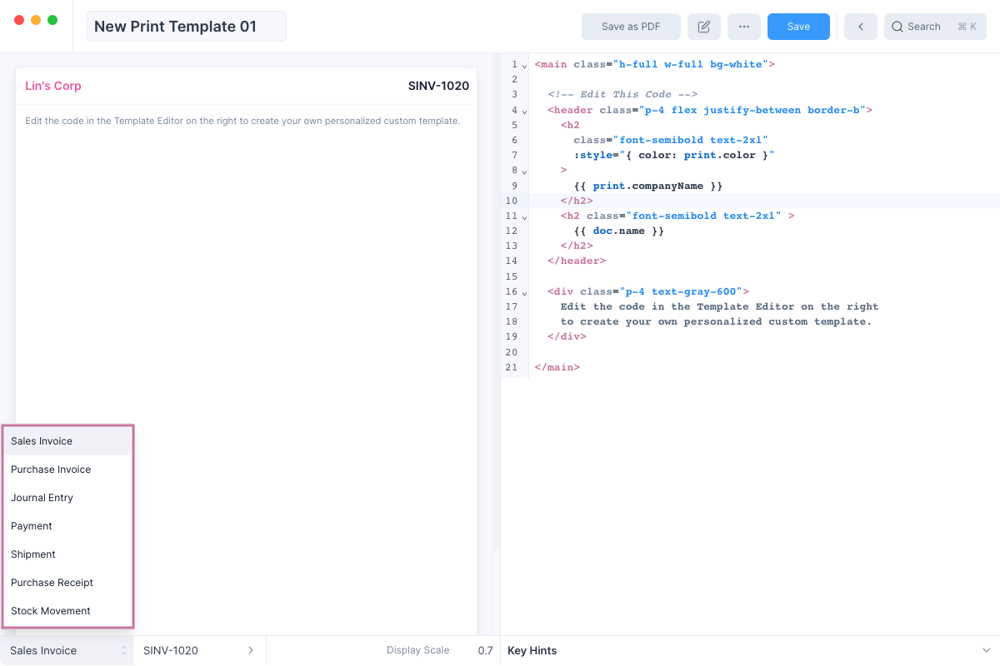

# Print Templates

The Print Template feature in Frappe Books allows you to create personalized
print templates for
[Invoices](/transactions/sales-invoices#printing-the-sales-invoice) and a few
other [Entries](/transactions/transactional-entries).

To view and create Print Templates navigate to its page using the sidebar:
`Setup > Print Templates`. Or alternatively open the Quick Search, type "Print
Template" and hit enter.


:::tip Preloaded Templates

When you create a new instance of Frappe Books, it comes preloaded with a few
templates.

You use these as they are, or you can _Duplicate_ and customize them.
:::

If you would like to familiarize yourself with the Template Builder interface
before learning how to create a Print Template, click
[here](/miscellaneous/print-templates#template-builder-interface).

## Creating a Print Template

To create a Print Template, first navigate to the Print Template list and click
on the blue `+` button.

You will now see the [Template Builder](/miscellaneous/print-templates#template-builder-interface) tool.

You can enable the _Edit Mode_ by clicking the edit button next to the _Save as
PDF_ button.

Next, select the template type. Sales Invoice is selected by default, but you
can create Print Templates for other entry types too.



:::tip Display Entry

You can change the example Entry being displayed. By default Frappe Books
selects the latest entry that has been created.
:::

Now you are ready to edit the Print Template

## Editing the Template

The left pane contains the Template Editor which is used to edit the template.
You can remove the preset template and write the template that you want here.


:::info Template Syntax

The templates follow the Vue.js template syntax. You can learn more about it
[here](https://vuejs.org/guide/essentials/template-syntax.html).
:::

:::tip Resizing the Template Editor

You can resize the Template Editor by clicking on the border and dragging it.


:::

### Displaying Values

Values can be displayed by mentioning their keys inside curly braces. For example:

```html
<h1>{{ doc.name }}</h1>
```

Here `doc.name` is the key for Invoice No and it will be displayed in an `h1`
element.

The Template Editor can help you by autocompleting the keys as you type the
name.

There are two sets of keys to display values:

1. `doc`: these keys are used to display values from the entry such as Invoice No,
   Account, Date, etc. These keys vary depending on the Entry Type.
2. `print`: these keys are used to read Print Settings values such as Logo,
   Email, Color, etc.

:::tip Key Hints
If you want to see the available values you can click on the **Key Hints**
section below the Template Editor.


:::

### Template Styling

You can either use [inline CSS
styles](https://developer.mozilla.org/en-US/docs/Web/HTML/Global_attributes/style)
or utility classes from
[tailwindcss](https://tailwindcss.com/docs/utility-first) to style the different
components of your templates.

### Applying Changes

To apply the changes made in the editor, you can:

1. Click outside the template editor
2. Press the shortcut keys (`⌃ return` for macOS and `Ctrl Enter` for other
   operating systems).

## Using the Template

After you have edited your template and clicked on the blue Save button to save
the changes you have made. You can use the templates save your entries as PDFs
which you can send to your customers.

To use the template, navigate to the entry and click on the Print button.


You will now see the print preview. You can change the template to be used from
the list on the left.


Once you are satisfied with your selection click on the blue Save as PDF button
to save it.

## Template Builder Interface

When you open any of the Print Templates or when you click on the blue `+`
button to create a new Template, you will be shown the Template Builder tool.


Here's a list of what each component does:

1. **Template Name**: text input to edit the Print Template name if it has not been saved.
2. **Save as PDF**: button to save the selected entry as a PDF file.
3. **Toggle Edit Mode**: button to toggle edit mode.
4. **More**: dropdown menu with options such as view the print settings, and selecting and saving the template file.
5. **Save**: button to save the Print Template after editing its values.
6. **Template Preview**: preview template after editing without saving it.
7. **Template Editor**: text input to edit the template.
8. **Template Type**: drop selector to set the template type.
9. **Display Entry**: entry to show in the preview area.
10. **Display Scale**: number input to change the Template Preview scale.
11. **Key Hints**: component that shows the available keys (such as `doc.name`,
    `doc.date`, etc) that can be used in the template.

## Tips for Creating Templates

Here are a few tips to help you create custom print templates.

### Duplicating preloaded templates

If you are not familiar with HTML, CSS and Vue.js Template Syntax then you might
find creating a custom template to be a bit challenging.

If this is the case, we suggest duplicating one of the Preloaded Templates and
editing the duplicate.


This way you can make and apply small changes and see how it affects the Preview
and step by step make the template like how you want it to look.

### Precaution when using tailwindcss

A few of the tailwindcss defaults (for example colors) used in Frappe Books have
been overriden using the
[`tsconfig.js`](https://github.com/frappe/books/blob/master/tailwind.config.js)
file.

Since these values are subject to change we suggest not relying on the overriden
tailwindcss styles. Not doing this may cause your templates to change when we
update the defaults.
