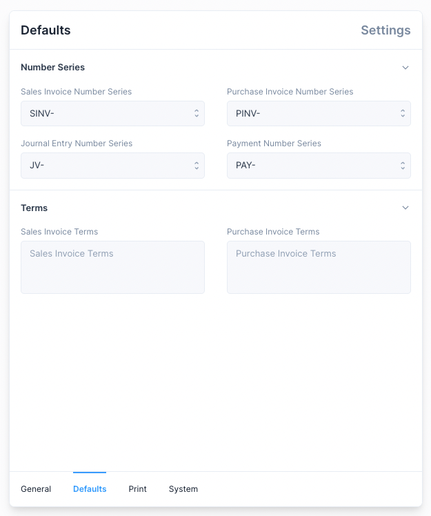
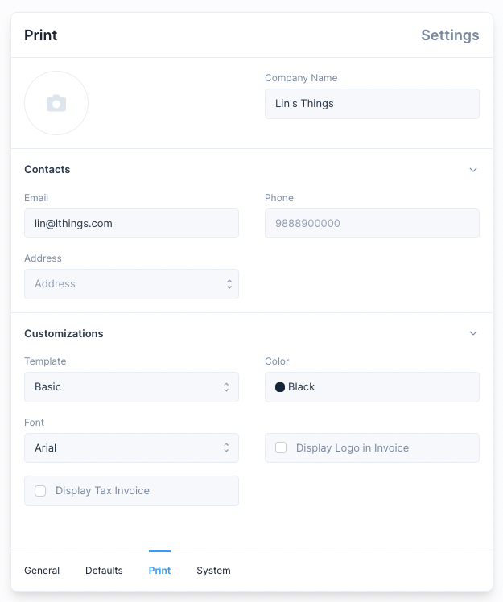

# Settings

To navigate to the settings use the Sidebar: `Setup > Settings`

There are a few tabs under Settings

1. General: Settings used to customize accounting defaults and enable features.
2. Defaults: Settings that are used to set defaults.
3. Print: Settings that are used to customize the Invoice Print View.
4. System: Settings used to customize System defaults.

:::tip Inventory Settings

[Inventory Settings](/inventory/settings) are visible only when Inventory has been enabled.
:::

## General Settings

These settings are used to set and customize accounting defaults.

**Settings that cannot be changed**

1. Full Name
2. Company Name
3. Country
4. Bank Name

::: info Setup Wizard
These values are set when setting up a new instance using the Setup Wizard.
:::

**Settings that can be changed**

1. Fiscal Year Start Date: used as the start date when displaying the reports by fiscal year.
2. Fiscal Year End Date: used as the end date when displaying the reports by fiscal year.
3. Write Off Account: account used when a Write Off amount is set when making a Payment
4. Round Off Account: account used to settle the credit and debit difference when
   the General Ledger is updated.
5. Enable Discount Accounting: used to enable the setting of discounts in invoices. ([link](/transactions/discount-accounting))
6. Enable Inventory: used to enable inventory management features. ([link](/inventory/introduction))

::: info GSTIN
GSTIN setting is available only when the country is set to India.

Setting this value will enable the GST Reports.
:::

## Defaults

These settings are used to set [Number Series](/miscellaneous/number-series) and
Terms defaults which are used when a new entry is created.

## Print Settings

Settings here can be altered to customize the Print View of an Invoice.

::: tip Print View
These settings can also be altered from the
[Print View](/transactions/sales-invoices#printing-the-sales-invoice) of an Invoice
:::

## System Settings

These settings are used to alter how values such as currency and time are
displayed.

1. Date Format: used to set how dates are displayed.
2. Hide Get Started: used to hide the Get Started section from the Sidebar.
3. Version: this is a read only field which tells you the current version of Frappe Books.
4. Locale: used to set the currency format, by default locale of the selected country is used.
5. Display Precision: used to set the number of digits are shown after the decimal.
6. Currency: used to set the currency used for all transactions.

::: info Get Started
Get Started is auto hidden on completion.
:::
