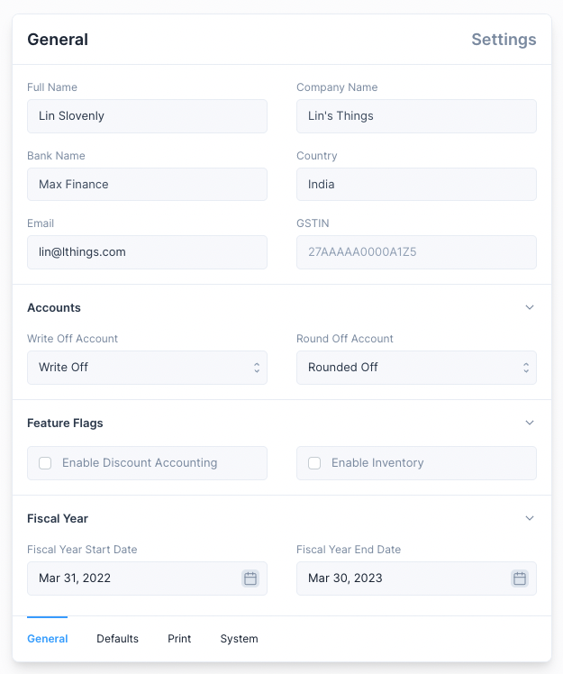

# Settings

To navigate to the settings use the Sidebar: `Setup > Settings`

There are three sections under Settings

1. Invoice: Settings that are used to customize the Print View.
2. General: Settings used to customize accounting defaults.
3. System: Settings used to customize System defaults.

## Invoice Settings

Settings here can be altered to customize the Print View of an Invoice.

::: tip Print View
These settings can also be altered from the
[Print View](/transactions/sales-invoices#printing-the-sales-invoice) of an Invoice
:::

## General Settings

These settings are used to set and customize accounting defaults.

The following settings are set during the Setup Wizard and cannot be altered.

1. Company Name
2. Country
3. Bank Name

The following settings can be altered

1. Write Off Account: account used when a Write Off amount is set when making a Payment
2. Round Off Account: account used to settle the credit and debit difference when
   the General Ledger is updated.
3. Fiscal Year Start Date: used as the start date when displaying the reports by fiscal year.
4. Fiscal Year End Date: used as the end date when displaying the reports by fiscal year.

::: info GSTIN
GSTIN setting is available only when the country is India.

Setting this value will enable the GST Reports.
:::

## System Settings

These settings are used to alter how values such as currency and time are
displayed.

1. Locale: used to set the currency format, by default locale of the selected country is used.
2. Date Format: used to set how dates are displayed.
3. Currency: used to set the currency used for all transactions.
4. Display Precision: used to set the number of digits are shown after the decimal.
5. Hide Get Started: used to hide the Get Started section from the Sidebar

::: info Get Started
Get Started is auto hidden on completion.
:::