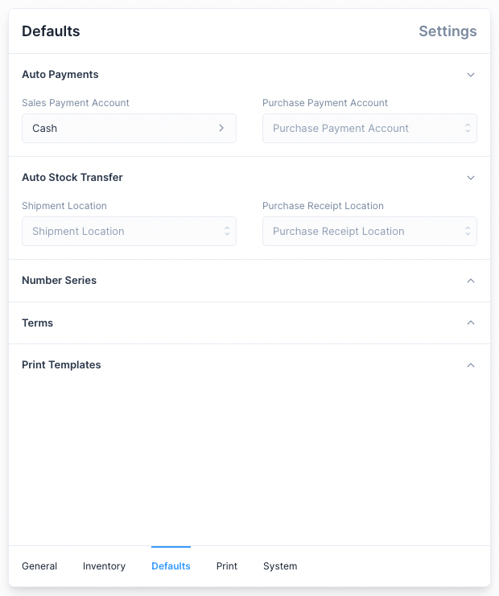
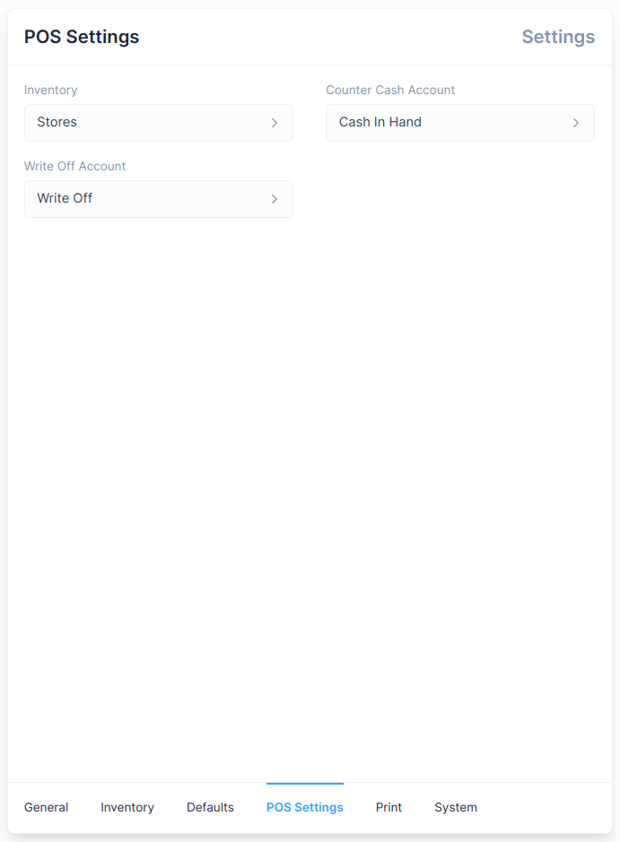

# Settings

To navigate to the settings use the Sidebar: `Setup > Settings`

There are a few tabs under Settings

1. General: Settings used to customize accounting defaults and enable features.
2. Defaults: Settings that are used to set defaults.
3. Print: Settings that are used to customize the Invoice Print View.
4. System: Settings used to customize System defaults.

:::tip Inventory Settings

[Inventory Settings](/inventory/settings) are visible only when Inventory has been enabled.
:::

## General Settings

These settings are used to set and customize accounting defaults.

**Settings that cannot be changed**

1. Full Name
2. Company Name
3. Country
4. Bank Name

::: info Setup Wizard
These values are set when setting up a new instance using the Setup Wizard.
:::

**Settings that can be changed**

1. Fiscal Year Start Date: used as the start date when displaying the reports by fiscal year.
2. Fiscal Year End Date: used as the end date when displaying the reports by fiscal year.
3. Write Off Account: account used when a Write Off amount is set when making a Payment
4. Round Off Account: account used to settle the credit and debit difference when
   the General Ledger is updated.
5. Enable Discount Accounting: used to enable the setting of discounts in invoices. ([link](/transactions/discount-accounting))
6. Enable Inventory: used to enable inventory management features. ([link](/inventory/introduction))

::: info GSTIN
GSTIN setting is available only when the country is set to India.

Setting this value will enable the GST Reports.
:::

## Defaults

These settings are used to set default values that are selected when creating an
entry. They allow for quicker creation of entries but can be changed when making
entries.

The following Defaults can be set:

1. Accounts used for Auto Payments.
2. Locations used for Auto Stock Transfers.
3. [Number Series](/miscellaneous/number-series) for transactional entries.
4. Terms to be used for certain transactional entries.
5. [Print Templates](/miscellaneous/print-templates) to be used when printing an entry.
6. [Point of Sale](/point-of-sale/introduction) 
   1. POS Customer: used as Default Customer for POS Transactions.
   2. Cash Denominations: to be used when creating and closing a POS Shift.

:::warning Auto Stock Transfer items

An Item from an Invoice is included in the auto Stock Transfer only if these conditions are met:

1. The item does not use Batches.
2. The item does not use Serial Numbers.
3. There is sufficient quantity of the item at the set default Location.

:::

## Print Settings

Settings here can be altered to customize the Print View of an Invoice.

::: tip Print View
These settings can also be altered from the
[Print View](/transactions/sales-invoices#printing-the-sales-invoice) of an Invoice
:::

## System Settings

These settings are used to alter how values such as currency and time are
displayed.

1. Date Format: used to set how dates are displayed.
2. Hide Get Started: used to hide the Get Started section from the Sidebar.
3. Version: this is a read only field which tells you the current version of Frappe Books.
4. Locale: used to set the currency format, by default locale of the selected country is used.
5. Display Precision: used to set the number of digits are shown after the decimal.
6. Currency: used to set the currency used for all transactions.

::: info Get Started
Get Started is auto hidden on completion.
:::

## POS Settings

1. Inventory: The Inventory for Point of Sale Transactions.
2. Counter Cash Account: The Account for Point of Sale transactions.
3. Write off Account: The Account which will be used to create Write off entries when closing
   a POS Shift.