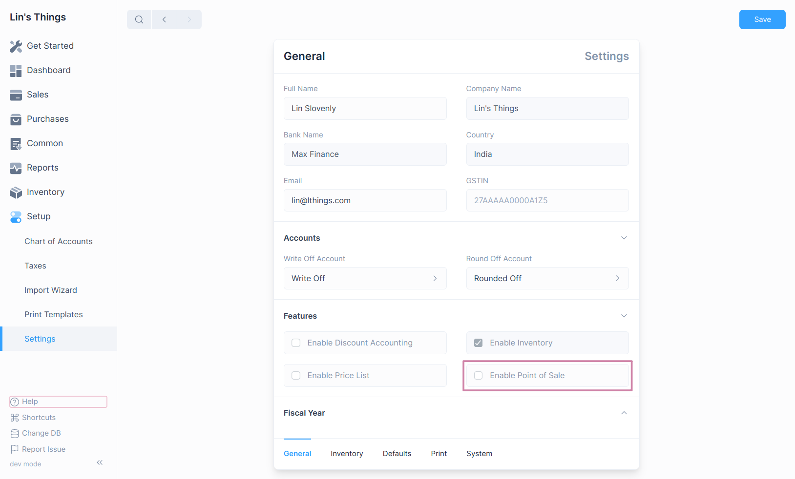

# Introduction to Point of Sale

## Enable Point of Sale

To use the Point of Sale feature, you need to enable the Inventory module first.
[Follow these steps to enable it](/inventory/introduction#enabling-inventory).

Once you have enabled the Inventory module, you can enable the
Point of Sale feature by checking **Enable Point of Sale** in General Settings.

To Navigate to the General Settings:
`Setup > Settings > General Tab.`

## Set Defaults

You can set default values for multiple options of the Point of Sale.
The following defaults can be configured:

1. Customer: Default customer for Point of Sale transactions.
2. Inventory: The Inventory used for Point of Sale transactions.
3. Print Template: The default print template for Point of Sale receipts.
4. Adjustment Account: Account for adjustment entries in Point of Sale.
5. Cash Denominations: To calculate POS Shift opening and closing Amounts.

To navigate: `Setup > Settings > Defaults Tab`.
