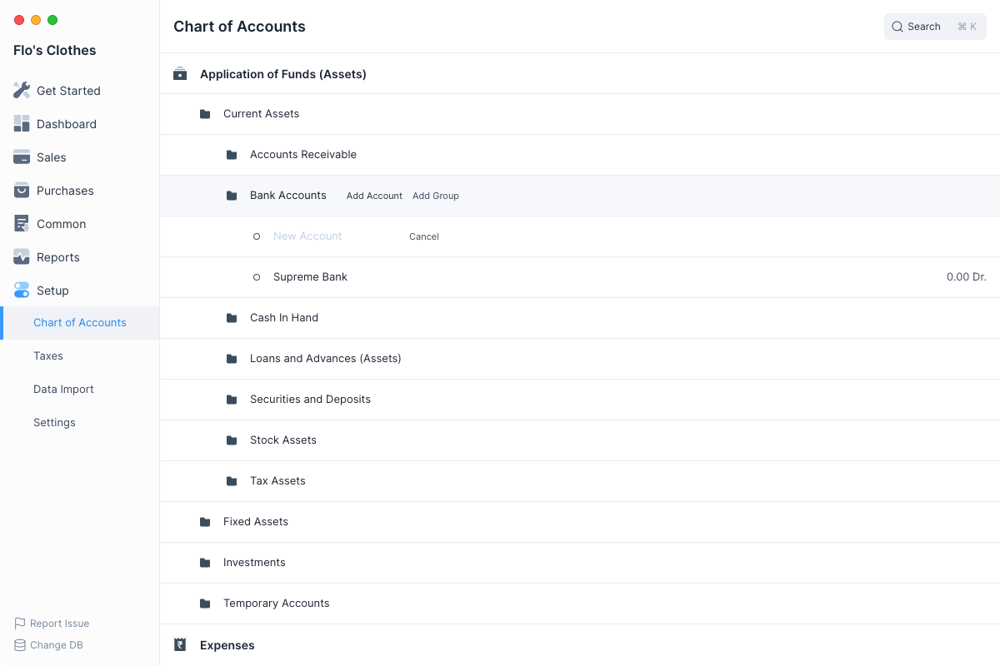
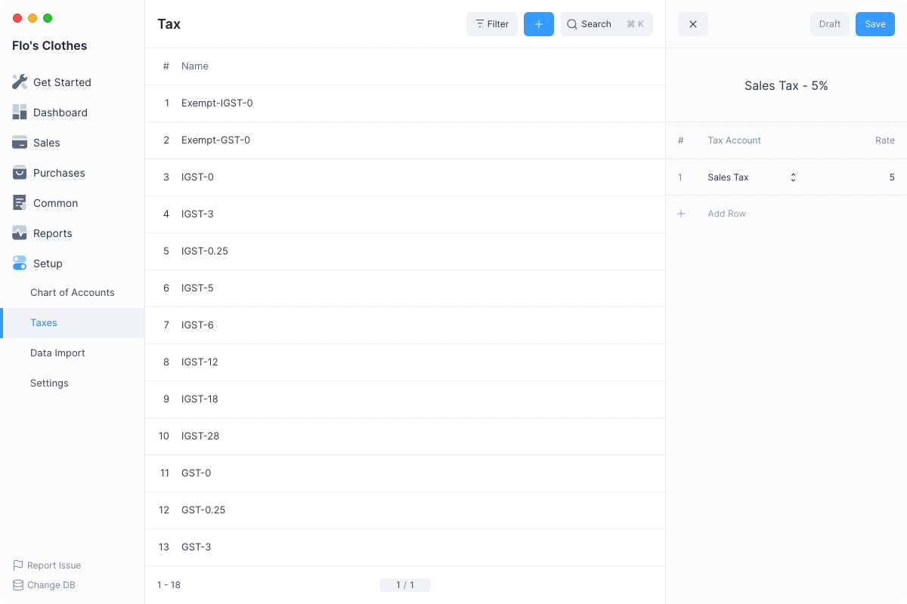
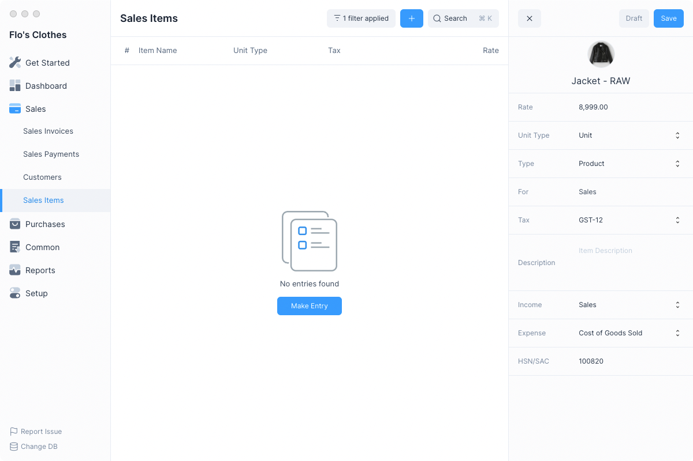
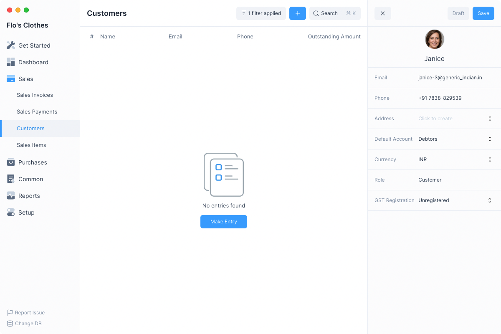

# Create Initial Entries

Let’s create some initial entries before you can start recording your
transactions.

## Add Additional Bank Accounts

Add any bank accounts your business has apart from the one already added in the Setup.

Navigate to the **Chart of Accounts** page from the sidebar.

`Setup > Chart of Accounts`

Then open the **Bank Accounts** group and click on **Add Account**.

`Application of Funds (Assets) > Current Assets > Bank Accounts > Add Account`

Enter the bank account name and press enter to create it. You can now transfer
funds in and out of this bank account.

## Add Taxes

If your company charges or will recover Sales Taxes, add any taxes that you will
use. First navigate to the **Taxes** page.

`Setup > Taxes`

1. **Create a New Tax Entry**: Click on the blue `+` button. Enter a name which will make
   it easier to identify. You can also mention the rate in the name. for e.g.
   Service Tax - 5%.
2. **Select the Tax Account and Rate**: You can add multiple rows with different
   Tax Accounts. This will make it easier to apply a set of Taxes which are
   frequently applied together on an Item. You can even create different taxes for
   different Items or a class of Items.
3. **Click on Save**

For more information on Taxes in Frappe Books click [here](/entries/taxes).

## Add Sales Items

One of the most important things you will add in Books are your products or
services that you provide to your customers. Navigate to **Sales Items**

`Sales > Sales Items`

1. **Create a New Item Entry**: Click on the blue `+` button. Enter the Name and the Rate
2. **Select Type**: Select if your Item is a Product or Service.
3. **Set Default Tax**: Setting the default Tax for your Item will fetch it
   automatically when you create an Invoice.
4. **Click on Save**

You can set or change the other details for the item. Such as the Income or
Expense accounts.

You can even set an image for the item.

For more information on Sales Items in Frappe Books click [here](/entries/items).

## Add Customers

Add your Customers to record their details and select them in Sales Invoices. First navigate to Customers

`Sales > Customers`

1. **Create a New Customer Entry**: Click on the blue `+` button. Enter the name of of the customer
2. **Click on Save**

You can enter additional details such as Email and Phone in the Customer entry.
This will be shown when creating a Sales Invoice PDF.

For more information on Customers in Frappe Books click [here](/entries/party).

---

You can now move onto the next step to set your Opening Balances.
