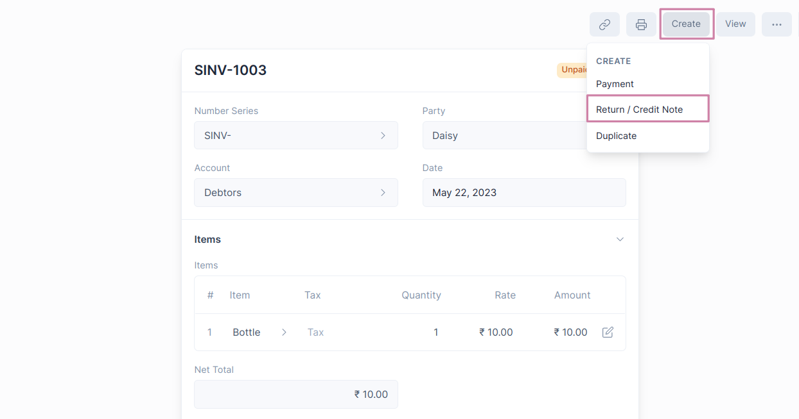
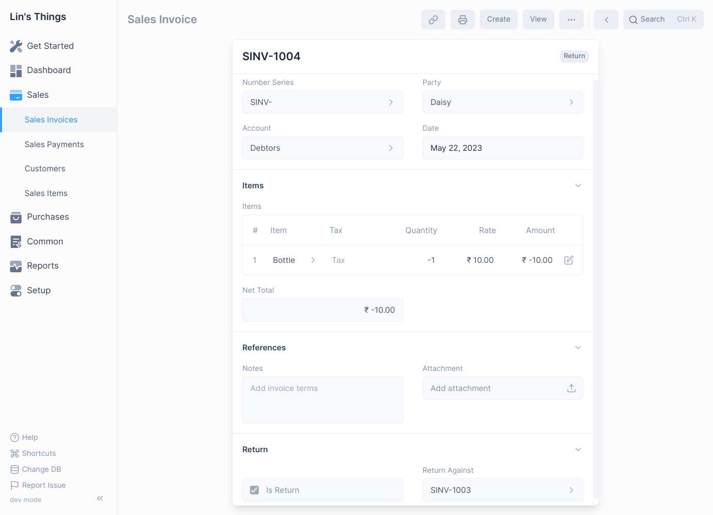
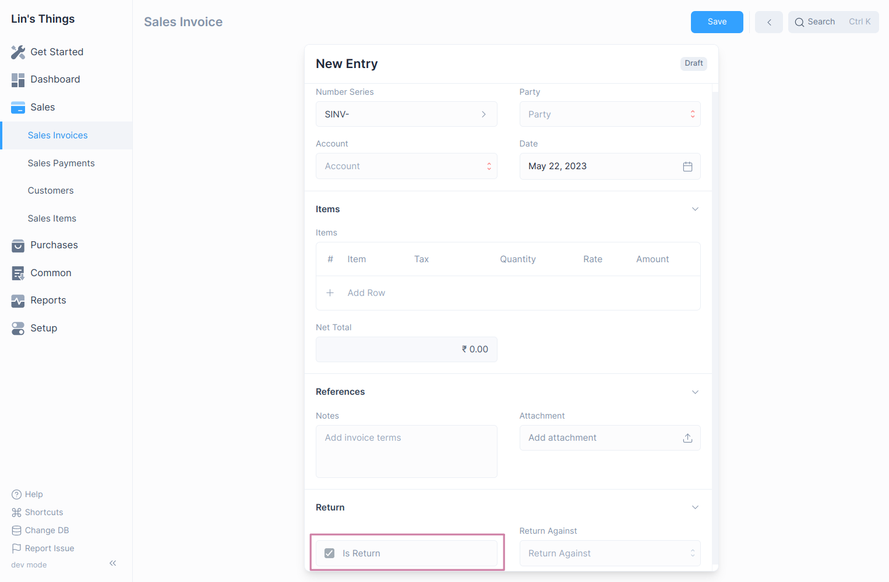
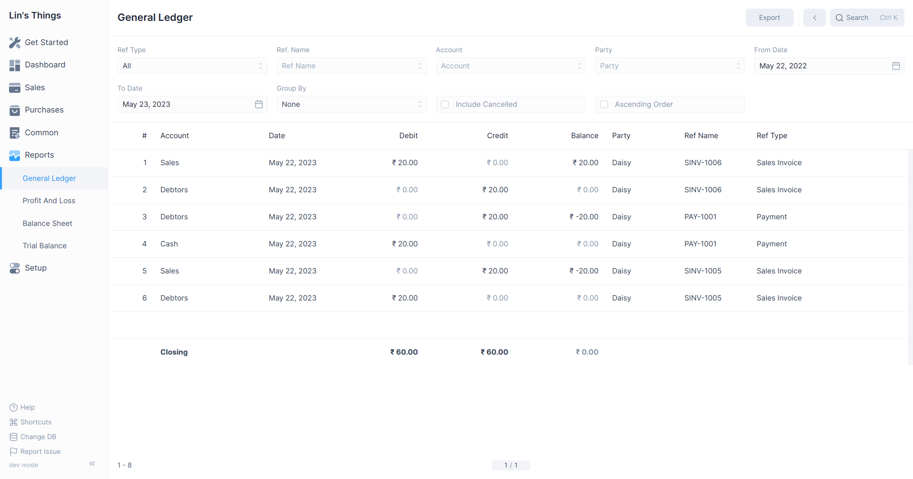

# Credit Notes

**A Credit Note is a document sent by a Seller to the Customer, notifying that a 
credit has been made to their account against the goods returned by the Buyer.**

A Credit Note is issued for the value of the goods that the Customer returns. 
this amount could be less than or equal to the total amount of the order.

## Creating Credit Notes

The user can create a Credit Note against the Sales Invoice or create a Credit 
Note directly from the Sales Invoice without mentioning reference.

### Creating from Sales Invoice

1. Go to the respective Sales Invoice and click on `Create > Return / Credit Note`.
   
2. The Party and Item details will be fetched as set in the Sales Invoice.
3. If the Party had paid partially or fully, make a Payment Entry against the 
   original Sales Invoice.
4. Save and Submit.

   

::: info 
The Item quantity and Payment amount will be negative since it's a return.
:::

### Creating Manually 
1. Navigate to the Sales Invoices page `Sales > Sales Invoices`
2. Then click on the blue `+` button to open the Sales Invoice form.
3. Fill Item Details.
4. Click on the `Is Return` checkbox to mark the Sales Invoice as Credit Note.
   
5. If you want to reference an original Sales Invoice, click on `Return Against`
   then select the target Sales Invoice.
6. Save and Submit

## How does Credit Notes affect General Ledger

When a Payment Entry is created against the original Sales Invoice, the amount 
will be added to the Party's account in negative value so that the amount will 
be adjusted the next time they make a purchase.

## No payment was made against Sales Invoice
If no Payment Entry was made against the original Sales Invoice, then you could
simply cancel the Sales Invoice. However, if only 5 out of 10 items from a Sales
Invoice are returned, creating a Credit Note is useful for updating the ledger.

Refer the [Sales Invoice](/transactions/sales-invoices.md) page for any other details.