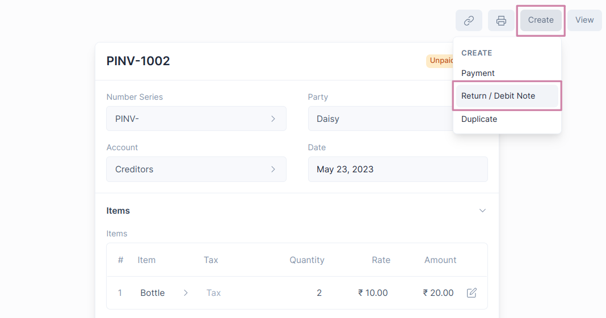
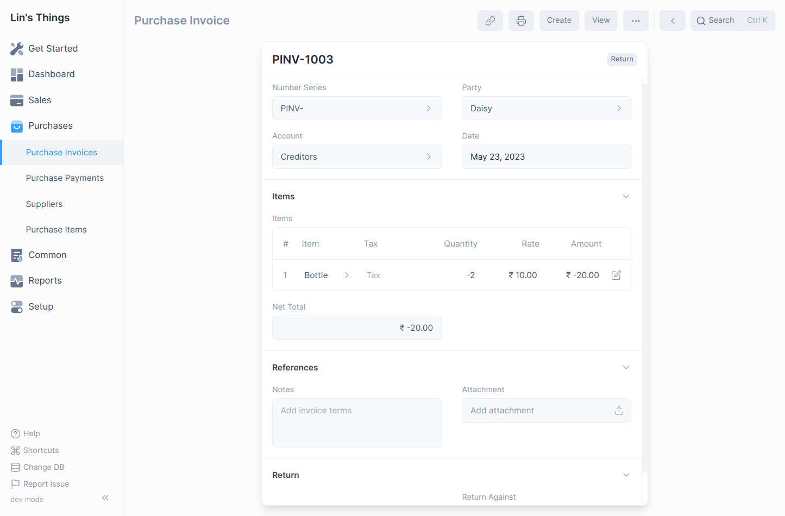
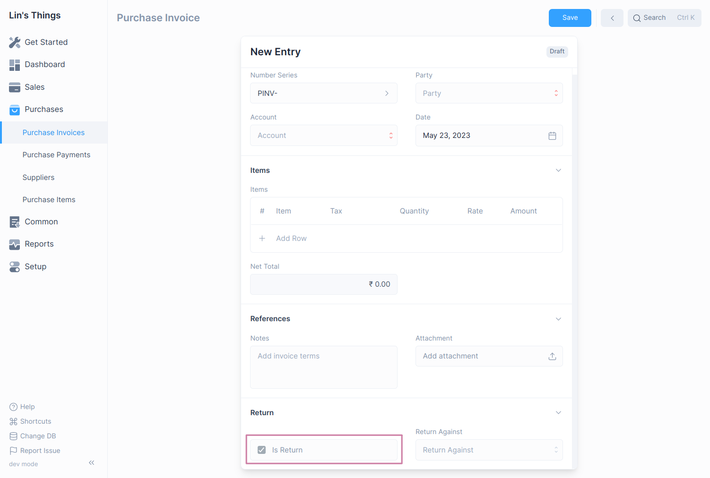
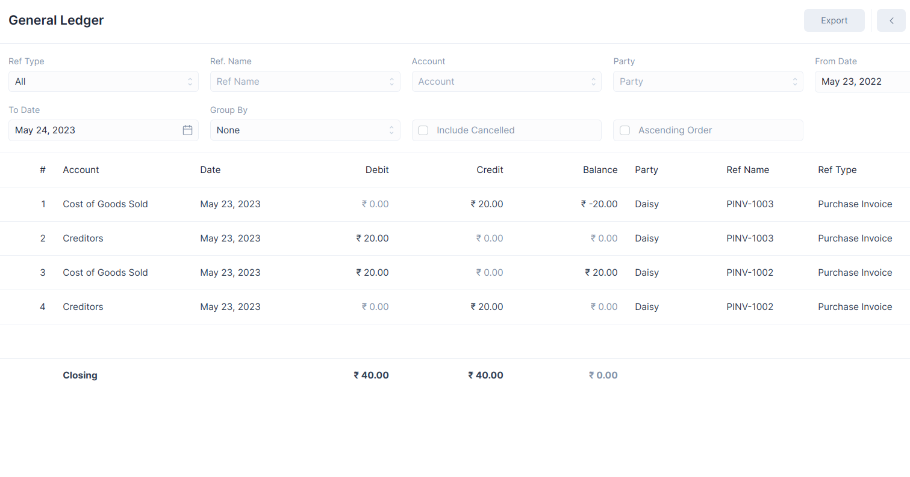

# Debit Notes

**A Debit Note is a document sent by a Buyer to the Supplier notifying that a 
debit has been recorded against the goods returned to the Supplier.**

A Debit Note is issued for the value of the goods returned. A Debit Note is for
your record of the debit against the returned Items.

## Creating Debit Notes

The user can make a Debit Note against the Purchase Invoice or they can directly
make Debit Note from the Purchase Invoice without reference.

### Creating from Purchase Invoice

1. Go to the respective Purchase Invoice and click on **Create > Return / Debit Note**.
   
2. The Supplier and Item details will be fetched as set in the Purchase Invoice.
3. If you had paid partially or fully, make a Payment Entry against the original
   Purchase Invoice.
4. Save and Submit.
   

### Creating Manually 

1. Navigate to the Purchase Invoices page `Purchase > Purchase Invoices`
2. Then click on the blue `+` button to open the Purchase Invoice form.
3. Check `Is Return` to mark the Purchase Invoice as Debit Note.
   
4. If you want to reference an original Purchase Invoice, click on `Return Against`
   then select the target Purchase Invoice.
5. Fill Item Details.
6. Save and Submit

## How does Debit Note Affect General Ledger

The Debit Note will reverse the impact of the original Purchase Invoice.

## No payment was made against the Purchase Invoice

In case no Payment Entry was made against the original Purchase Invoice, you 
could just cancel the Purchase Invoice. But, if only 5 out of 10 Items are being
returned from an invoice, creating a Debit Note is useful for updating the ledger.