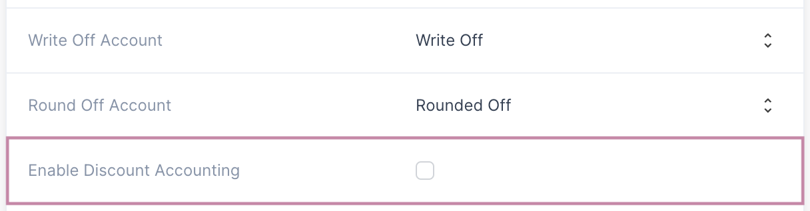
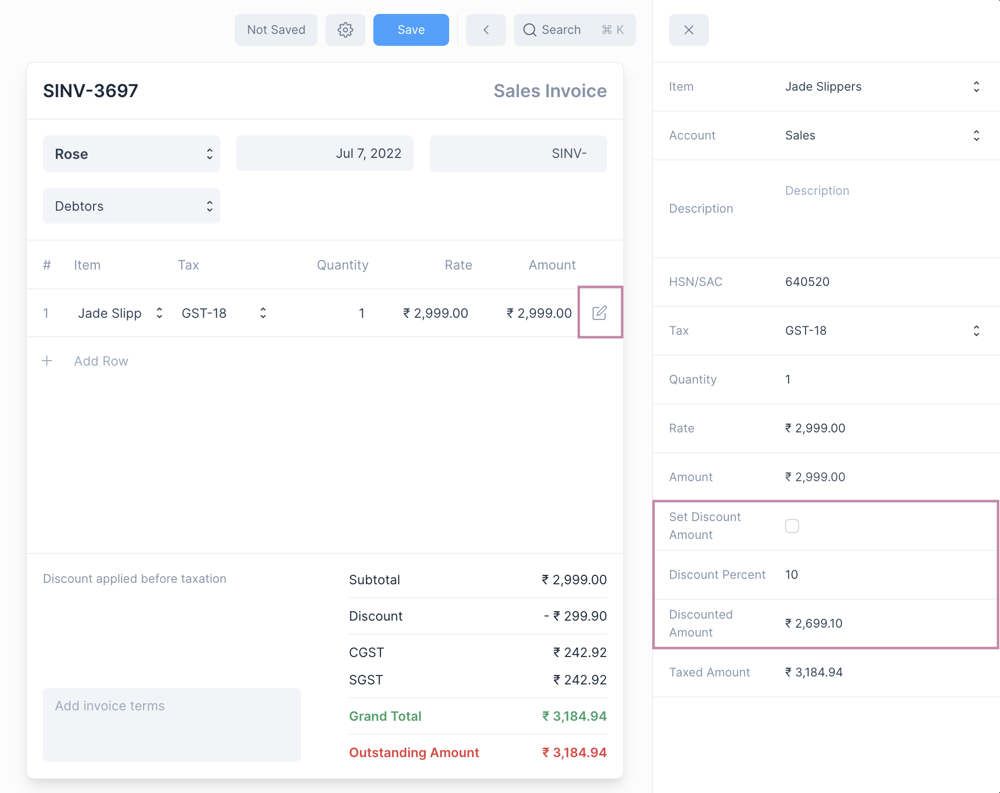

# Discount Accounting

Discount is a deduction that is applied to the cost of an item. Frappe Books
supports applying discount to an invoice on an item-wise basis.

## Enable Discount Accounting

To enable discount accounting, first navigate to General Settings:
`Setup > Settings > General`

Then check the Enable Discount Accounting checkbox.

::: warning
Once Discount Accounting is enabled, it cannot be disabled.
:::

After that set the account that will be used for discounts

::: info
The discount account is an Indirect Income account, you can create it using the
[Chart of Accounts](/miscellaneous/chart-of-accounts)
:::

## Setting Discount Amount

Discount is applied on an item-wise basis. After you have enabled discount click
on the edit button on the item row to set the discount.

This will open Quick Edit Form to edit the invoice item values. Discount can be
set in two ways:

1. Setting a Discount Percent (default)
2. Setting a Discount Amount

To set the Discount Amount click on Set Discount Amount. Once the Discount
Amount or Percent is set the Discounted Amount will be shown.

::: tip Setting Discounted Amount
You can directly set the Discounted Amount, Frappe Books will automatically
calculate the item rate. 
:::

## Discount After Tax

By default the Discount is applied before the Tax is calculated.

To apply the Discount after the Tax, select the Discount After Tax checkbox
after opening the settings for the Invoice.

