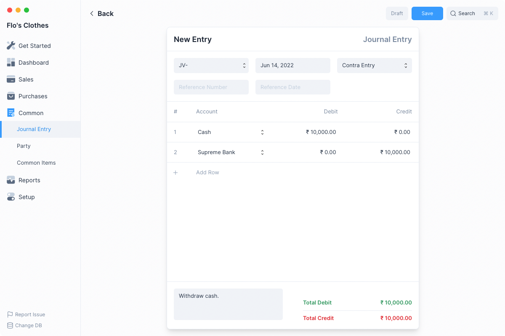

# Journal Entries

Journal Entries are transactional entries used to record transactions that don’t
strictly identify as a Sale or Purchase. Such as the transfer of funds from a
Bank Account to a Cash Account.

## Creating Journal Entries

To create a Journal Entry first navigate to the Journal Entry page

`Common > Journal Entry`

Then click on the blue `+` button to open a new Journal Entry form.

1. Set the type of Journal Entry.
2. Add rows for each Account and set the amounts being credited and
   debited.
3. Click on Save and then Submit.

::: info Double Entry Bookkeeping
When making a Journal Entry, you must ensure that the total amount in the Debit
column should equal the total amount in the Credit column.
:::

After clicking Submit, Frappe Books will the make ledger entries and update the
account balances.

You can check the entries by clicking Ledger Entries under the `...` menu.

## Examples

These are two examples of how you can make direct Journal Entries to account for
transactions that are different from Sales or Purchases.

### Recording Expenses

When you have expenses that you pay at the time of purchase, you can record an
Expense directly using Journal Entry.

To do so add two rows to a new Journal Entry form, one for Debit and one for
Credit.

Let’s say you incur an expense of ₹5,000 for traveling to a client site, and you
paid it directly from your Bank Account, then you must add the following rows:

| Account         | Debit  | Credit |
| --------------- | ------ | ------ |
| Bank Account    |        | ₹5,000 |
| Travel Expenses | ₹5,000 |        |

### Recording Prepayments

When a customer pays for a product or service that you haven’t delivered yet, it
cannot be booked as Income yet. This is a Liability for your business to fulfill
later.

To make an entry that reflects this, add two rows to a new Journal Entry form.

1. One which Debits the amount into the Bank Account because you have received
   the payment.
2. Another which Credits the amount into a Liability account you may create
   known as Prepayments.

| Account      | Debit  | Credit |
| ------------ | ------ | ------ |
| Bank Account | ₹5,000 |        |
| Prepayment   |        | ₹5,000 |
