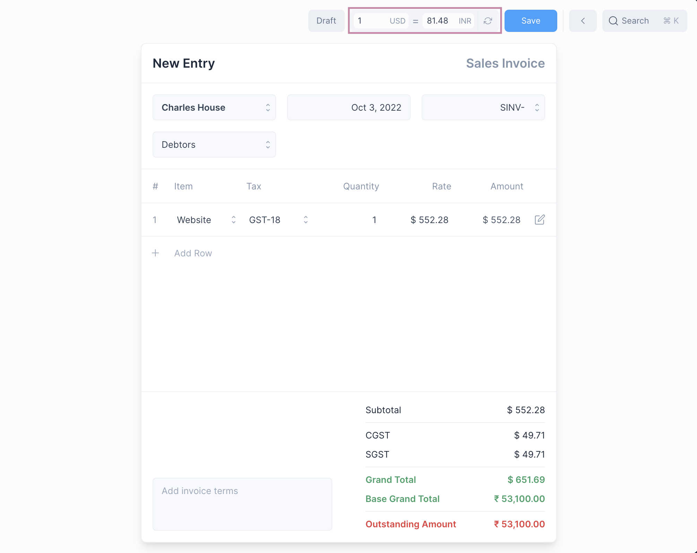
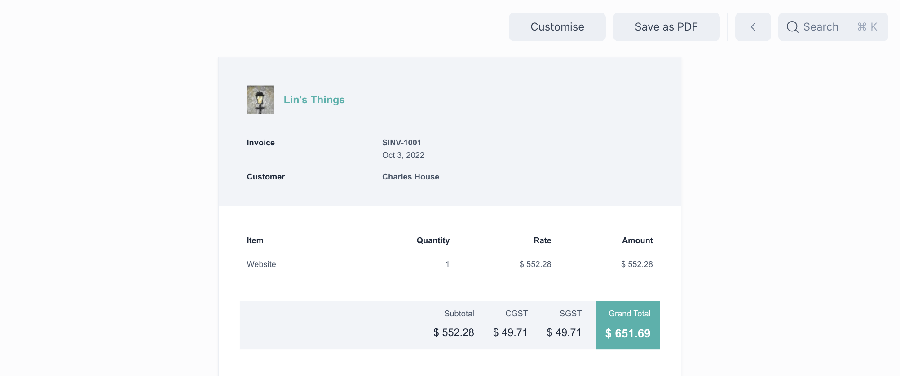
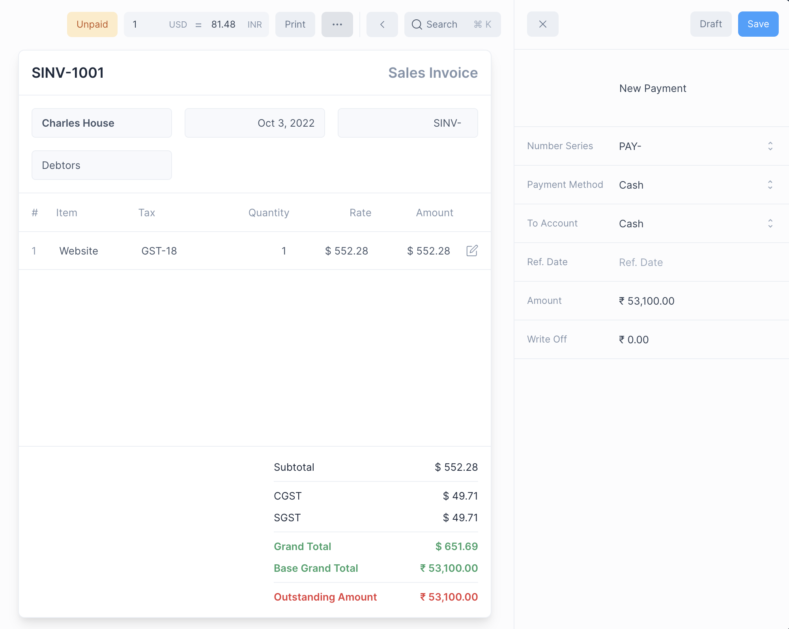
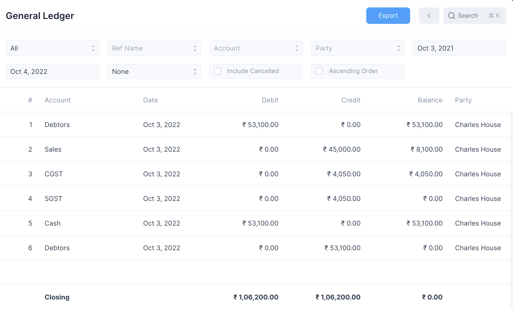
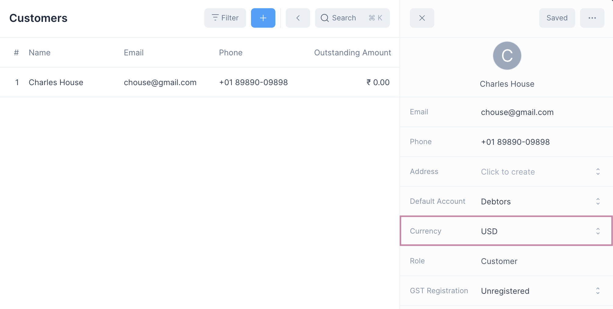
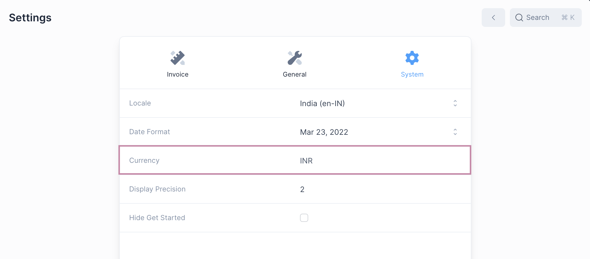

# Multi Currency Invoicing

Frappe Books allows you to create and print invoices in your customers currency.

::: tip Suppliers and Purchase Invoices
The same applies procedure applies for creating a Multi Currency Purchase
Invoice. Just set a different currency when creating a Supplier entry.
:::

## Creating a Multi Currency Invoice

To enable a multi currency invoice you need to do two things:

1. Create a Customer entry with a [different currency](/transactions/multi-currency-invoicing#customer-and-company-currency) from the company currency.
2. Select the Customer when creating a new invoice.

This will display the [exchange rate](/transactions/multi-currency-invoicing#exchange-rate) widget.

::: info Fields using Company Currency
The Base Grand Total and Outstanding Amounts are displayed in the company currency.
:::

## Printing

After submitting, on clicking Print, the invoice can be printed in the customers currency.

## Payments

Payments entries are made in the company currency. The exchange rate set when
submitting the invoice is used to decide the amount to be paid.

On making the payment the Outstanding Amount will be updated accordingly, and any
rounding differences will be balanced using the [Round Off Account](/miscellaneous/settings#general-settings).

## Ledger Entries

Ledger Entries are created using the company currency. The exchange rate set
when submitting the invoice is used to decide the recorded amounts.

## Exchange Rate

When a multi currency invoice is made, the ledger entries are created in the
company currency.

::: info Exchange Rate
Company Currency = Customer Currency ⨉ Exchange Rate
:::

## Customer and Company Currency

Multi currency invoice is possible only if the two currencies are different from
each other.

### Customer Currency

This is set when a [Customer](/entries/party) entry is created.

### Company Currency

This is set when [initializing](/setting-up/getting-started) a new Frappe Books instance

