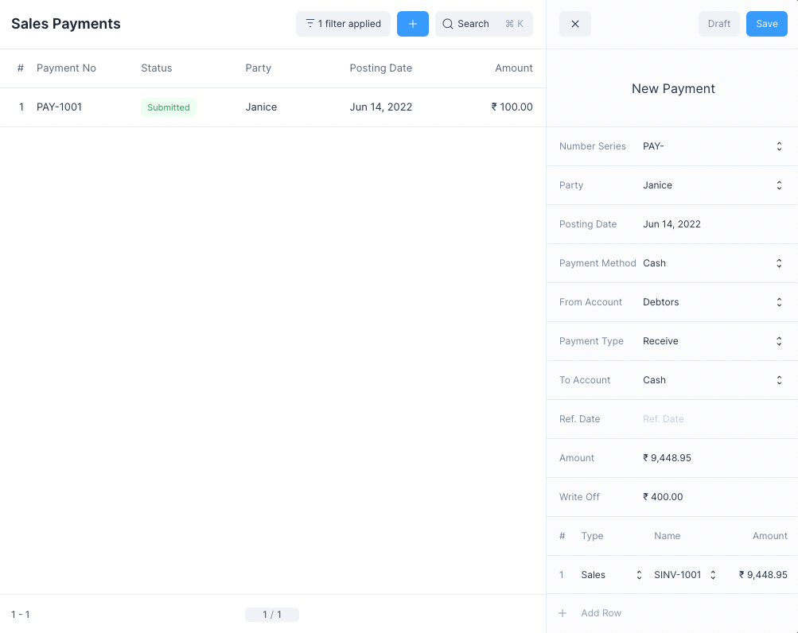
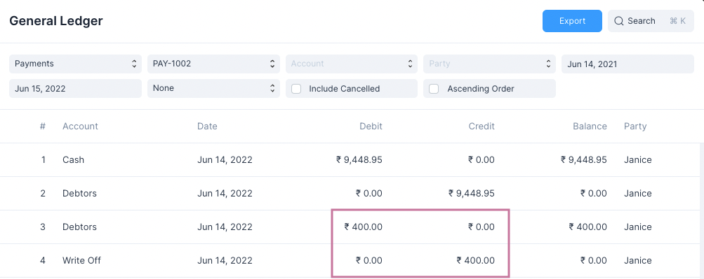

# Payments

Payments are a type of transactional entry that indicates the transfer of funds.

Payments usually follow a sale or a purchase, depending on this a Payment entry
can be made to either Receive or Pay funds.

|   # | Transaction | Payment Type | To Account          | From Account        |
| --: | :---------- | :----------- | :------------------ | :------------------ |
|   1 | Sale        | Receive      | Bank, Cash Accounts | Accounts Receivable |
|   2 | Purchase    | Pay          | Accounts Payable    | Bank, Cash Accounts |

## Making Payments

To make a Payment first navigate to the Payment page

- For Sales: `Sales > Sales Payments`
- For Purchases: `Purchases > Purchase Payments`

Then click on the blue `+` button. This will open the Payment quick edit form.

You can select the Party and enter other the details of the Payment.

Once the details have been set you can click on Save and then Submit to record
the Payment.

### Payment Reference

If the Payment is being made for an invoice, you can add a reference to the
invoice in the table at the bottom.

This will update the Outstanding Amount on the invoice.

::: tip Invoice Payment
A more convenient way of settling an Invoice Payment is to do so using the Make
Payment option from the Invoice Form.
:::

### Write Off Amount

The write off amount is a deduction on the payment.

This amount is booked under the Write Off Account that can set under General
settings: `Setup > Settings > General`

::: info Transfered Amount
The final amount to be paid or received = Amount - Write Off
:::

## Making Payments from Invoices

To make an Invoice Payment to settle the Outstanding Amount of a Sales Invoice
or a Purchase Invoice, you can navigate to the Invoice form and click on the Make
Payment button under the `...` menu.

For more information check these links:

- [Making Sales Payments](/transactions/sales-invoices#making-sales-payments)
- [Making Purchase Payments](/transactions/purchase-invoices#making-purchase-payments)
