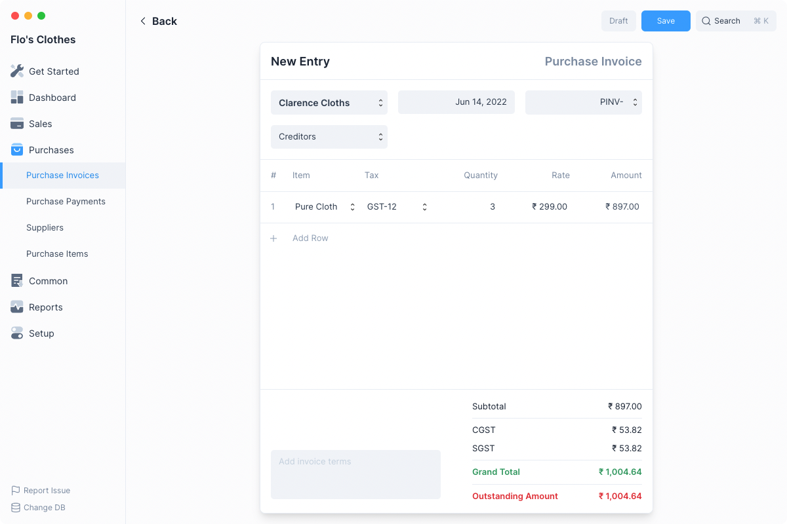
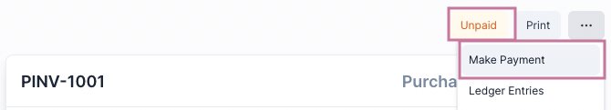
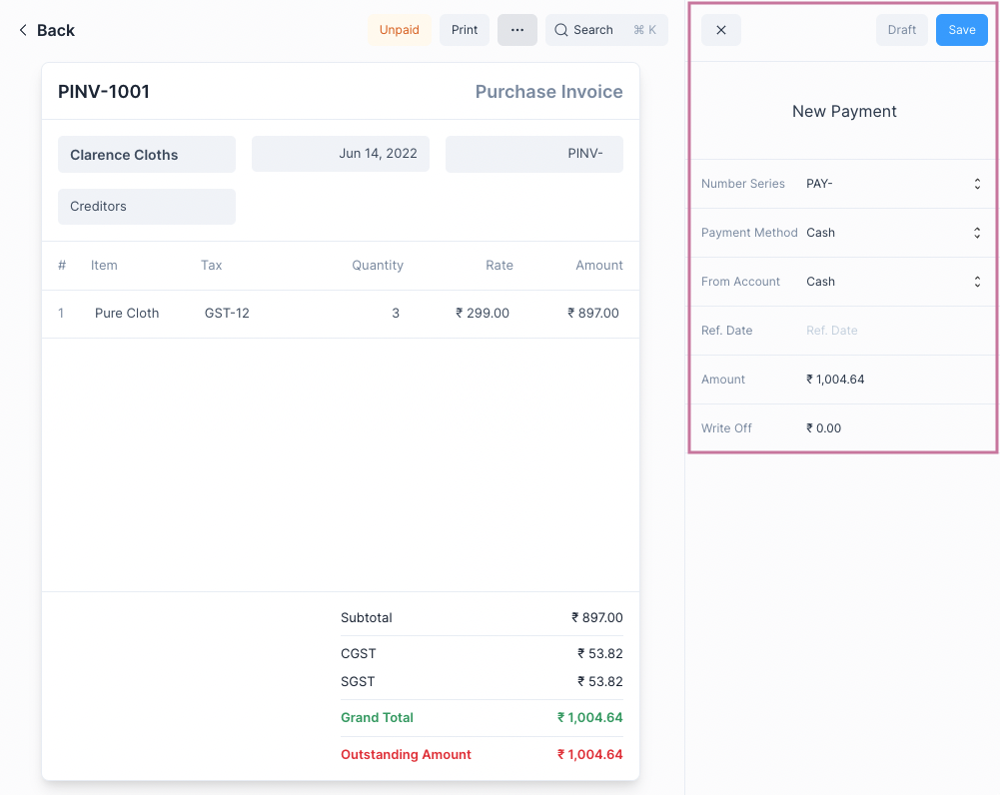
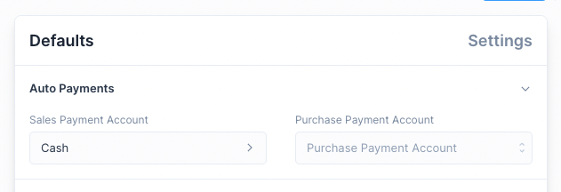
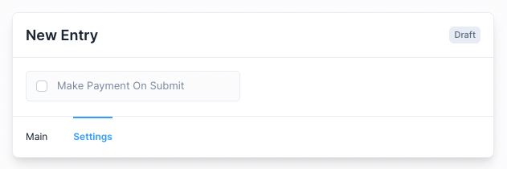
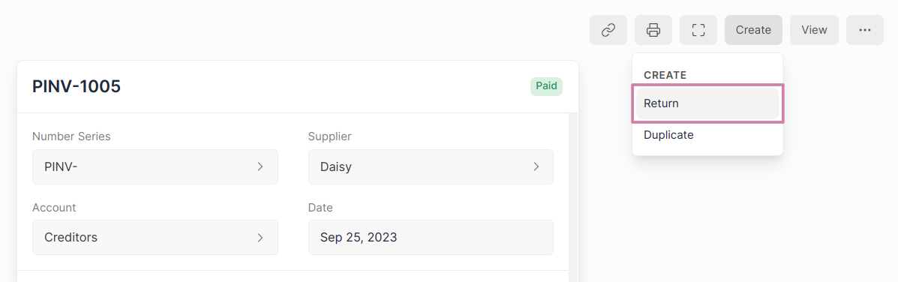
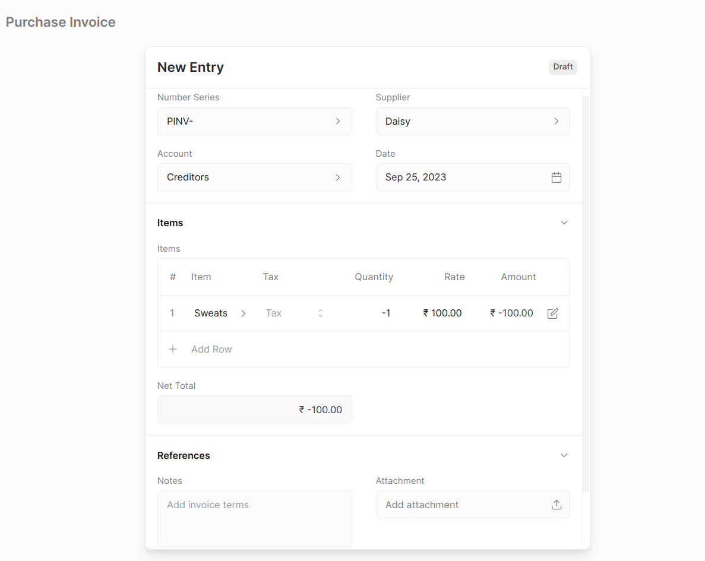
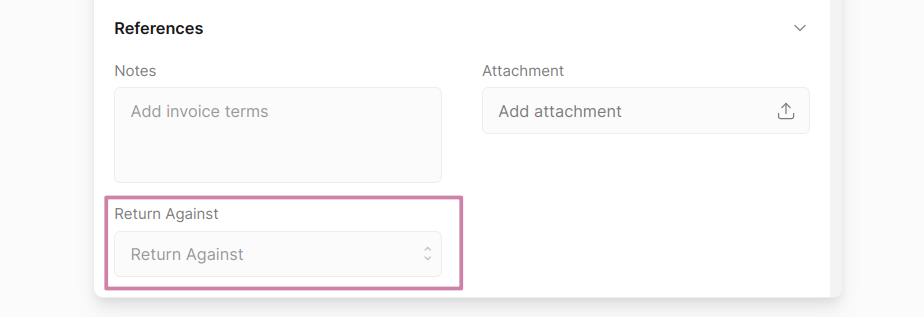

# Purchase Invoices

Purchase Invoices are bills that your supplier sends you when you make a
purchase.

It is a transactional entry that denotes a purchase.

## Creating Purchase Invoices

If you have set up your Frappe Books with Accounts, Taxes, Purchase Items, and
Suppliers, creating a Purchase Invoice is as simple as it gets.

First navigate to the Purchase Invoices page

`Purchases > Purchase Invoices`

Then click on the blue `+` button to open the Purchase Invoice form.

1. Select the Supplier from whom you will be making a purchase.
2. Click on Add Row and select the Item being purchased. Default Tax will be
   fetched you can change it if required.
3. Enter the Quantity.
4. You can add more items or if you are done, click on Save.
5. Once finalized, click on Submit. Frappe Books will do the required ledger
   entries against the appropriate accounts.

This invoice is now in _“Submitted”_ state, it cannot be edited. The purchase
transaction has been recorded.

## Making Purchase Payments

Once a purchase invoice has been submitted, you’ll need to record payment
against it to denote that you’ve paid the money.

To make a Payment first navigate to the Purchase Invoice, then click on the
`...` menu button. Then click the Make Payment option.

This will open the Payment quick edit form with the outstanding amount
auto-filled.

You can change the values and click on Save. This will Save and Submit the
Payment.

On making the Payment, Frappe Books will make the necessary ledger entries to
increase the payment amount in Accounts Payable and decrease the amount in your
Bank or Cash Account.

It will also update the Outstanding Amount on the invoice form.

::: info Purchase Invoice Status
Until Payments are made to settel the Outstanding Amount, the Purchase Invoice
will be in the **Unpaid** state.

Once the Outstanding Amount reaches 0, the status will change to **Paid**.
:::

### Auto Payments

You can simplify the _Purchase Invoice → Payment_ workflow by using Auto
Payments. For this you just need to set the default accounts for Purchase Payment.

This can be done in `Setup > Settings > Defaults > Auto Payments`:

Once this is set, whenever you Submit a Purchase Invoice a Payment entry will
automatically be created.

::: tip Disable Auto Payment for a Purchase Invoice

You can disable Auto Payment for a single Purchase Invoice by unchecking the Make
Payment On Submit check box in the Settings tab before Submitting the Purchase
Invoice entry.

:::

## Purchase Invoice Return

The user can create a Purchase Invoice Return directly from the original Purchase
Invoice document or manually from the New Purchase Invoice Entry.

### Creating a Purchase Invoice Return

1. Open the original Purchase Invoice document.
2. Click on **Create > Return**.
   
3. The Party and Item details will be fetched as set in the original Purchase
   Invoice document. You can set the quantity of Items returned in negative
   numbers.
   
4. Save and Submit.

::: info
The Item quantity and Payment amount will be in negative figures to indicate
that it's a return.
:::

### Creating Manually

1. Navigate to the Purchase Invoice page `Purchases > Purchase Invoice`
2. Click on **Return Against** then select the target Purchase Invoice against
   which you returned the Items.
   
3. Fill Item details.
4. Save and Submit.

## Purchase Invoice impact on General Ledger

The Purchase Invoice Return entry will create General Ledger entries to reverse
the impact of the original Purchase Invoice.

