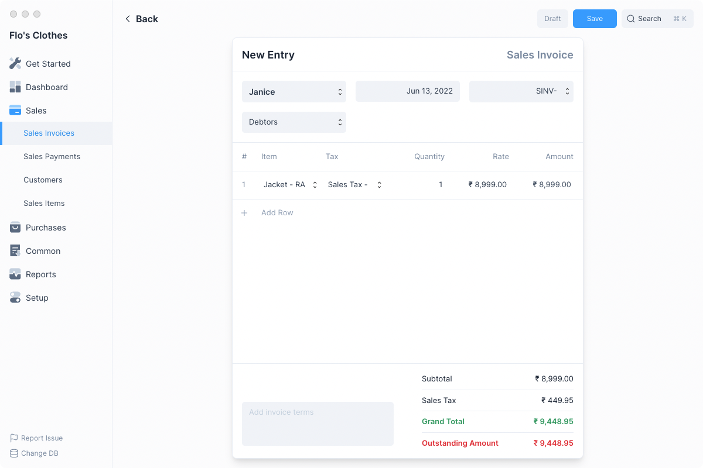
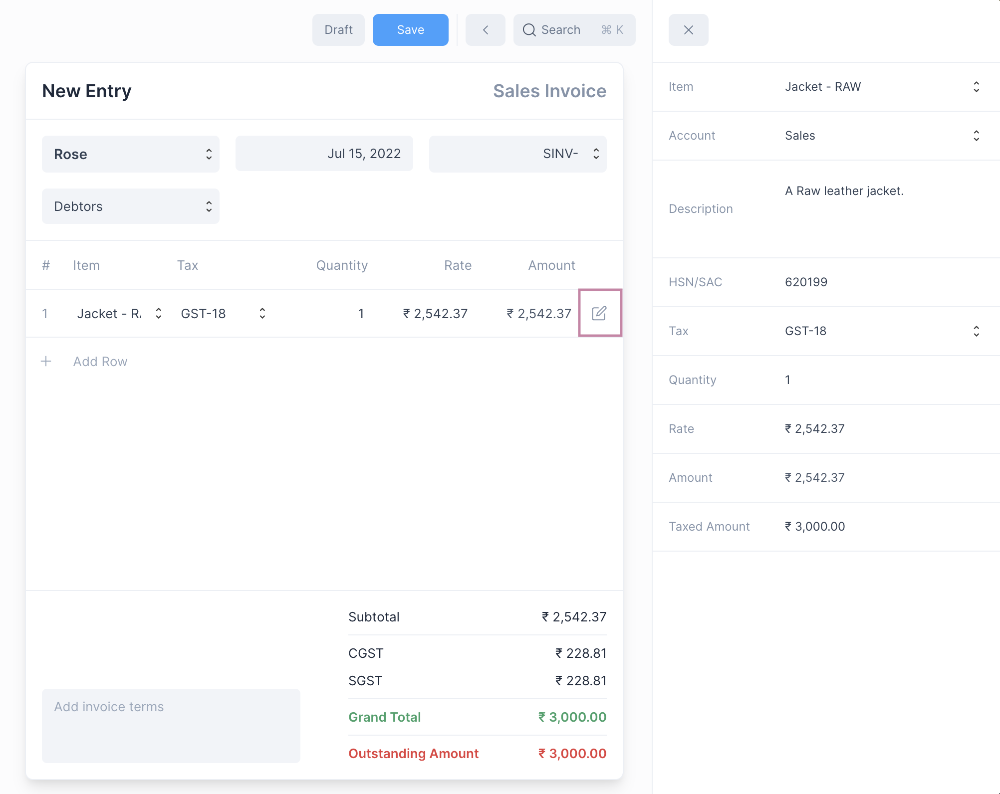
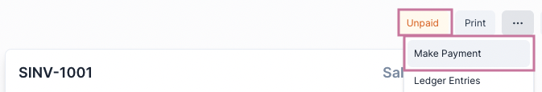
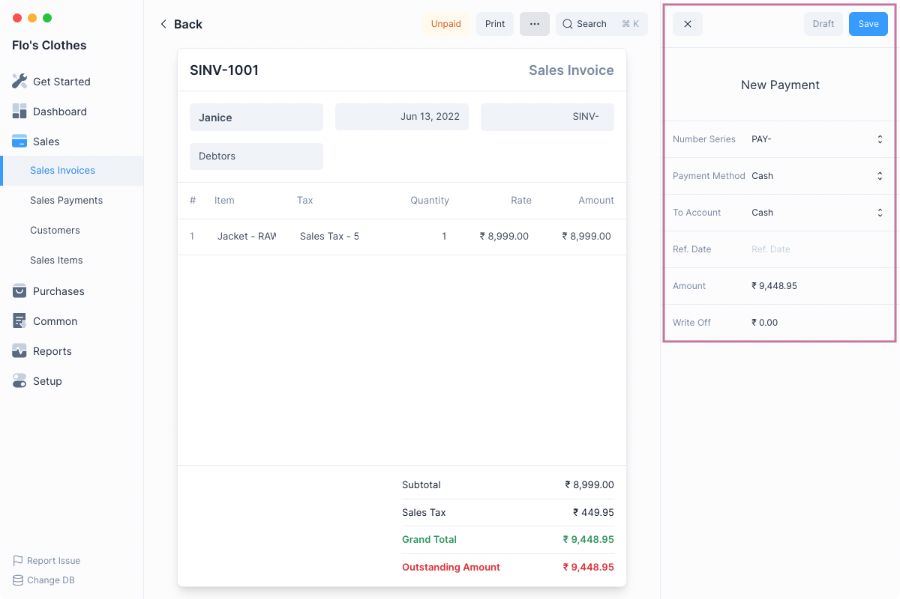
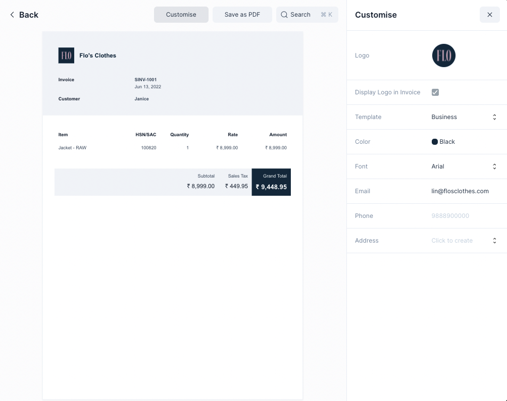

# Sales Invoices

Sales Invoices are bills that are sent to your customers when an income is
booked.

It is a transactional entry that denotes a sale.

## Creating Sales Invoices

If you have set up your Frappe Books with Accounts, Taxes, Sales Items, and
Customers, creating a Sales Invoice is as simple as it gets. If not you can the
follow the steps [here](/setting-up/getting-started).

First navigate to the Sales Invoices page

`Sales > Sales Invoices`

Then click on the blue `+` button to open the Sales Invoice form.

1. Select the Customer to whom you will be making a sale.
2. Click on Add Row and select the Item being sold. Default Tax will be fetched
   you can change it if required.
3. Enter the Quantity.
4. You can add more items or if you are done, click on Save.
5. Once finalized, click on Submit. Frappe Books will do the required ledger
   entries against the appropriate accounts.

This invoice is now in _“Submitted”_ state, it cannot be edited. The sales
transaction has been recorded.

## Editing an Invoice Item

To edit the values of an Invoice Item click on the edit button on the item row

From here you can change the item description, HSN code check the Taxed Amount,
etc.

::: tip Setting the Taxed Amount
You can directly set the Taxed Amount, Frappe Books will calculate the Rate of
the Item automatically.
:::

## Making Sales Payments

Once a sales invoice has been submitted, you’ll need to record payment against
it to denote that you’ve received the money.

To make a Payment first navigate to the Sales Invoice, then click on the `...`
menu button. Then click the Make Payment option.

This will open the Payment quick edit form with the outstanding amount
auto-filled.

You can change the values and click on Save. This will Save and Submit the
Payment.

On making the Payment, Frappe Books will make the necessary ledger entries to
reduce the payment amount from Accounts Receivable and increase the amount in
your Bank or Cash Account.

It will also update the Outstanding Amount on the invoice form.

::: info Sales Invoice Status
Until Payments are made to settel the Outstanding Amount, the Sales Invoice
will be in the **Unpaid** state.

Once the Outstanding Amount reaches 0, the status will change to **Paid**.
:::

## Printing the Sales Invoice

To export the Sales Invoice as a PDF, click on the Print button next to the
`...` menu above the Sales Invoice Form.

This will open the Print View, you can click on the Customize button to
customize it.

You can now add your company logo and select a brand color that matches your
business’ primary color. You can also change the style by selecting one of the
given Templates. Choose any that fits your style.

Once you have completed customizing, click on Save as PDF to save the Sales
Invoice.

After saving the PDF you can take a print out of it using your printer's
software.
