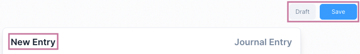
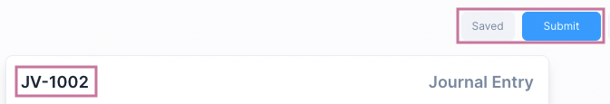
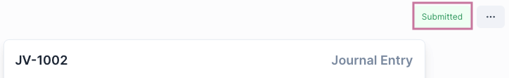
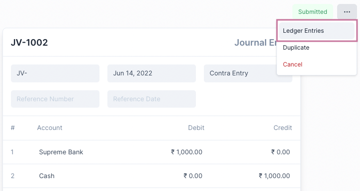
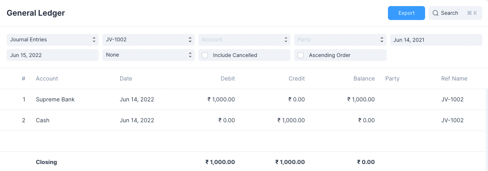
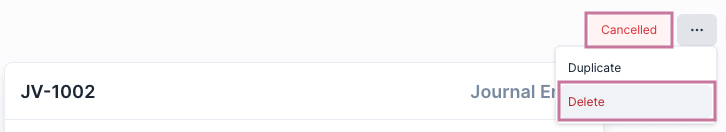
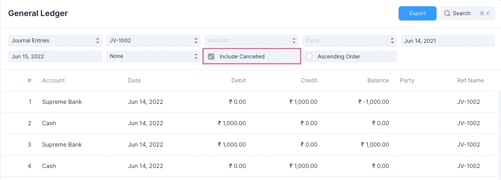
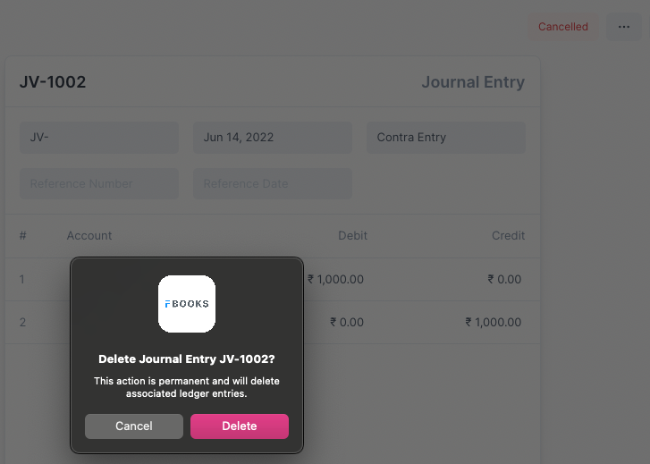

# Transactional Entries

In Frappe Books transactions are a special type of entry. These are entries that
affect Accounts.

The following are transactional entries in Frappe Books

- Sales Invoice
- Purchase Invoice
- Payments
- Journal Entries

## States of a Transactional Entry

A transactional entry goes through the following states

|   # | State     | In Database | Editable | In Analytics |
| --: | :-------- | ----------: | -------: | -----------: |
|   1 | Draft     |          No |      Yes |           No |
|   2 | Saved     |         Yes |      Yes |           No |
|   3 | Not Saved |          No |      Yes |           No |
|   4 | Submitted |         Yes |       No |          Yes |
|   5 | Cancelled |         Yes |       No |           No |
|   6 | Deleted   |          No |       No |           No |

Check the sections below on more details about these states.

## Making an Entry

To create and entry first navigate to the page, then click the blue `+` button.

::: info Transaction Form
Other than Payments all other transactional entries are displayed in full page forms.
Payments are displayed in a quick edit form.
:::

To record an entry it needs to first be _Saved_ then _Submitted_.

### Draft

Initially the Entry is in the **Draft** state. This means that its values can
still be edited.

Before the entry has been saved by clicking the blue Save button

1. No name is assigned to the entry
2. The entry has not yet been stored in the database

### Saved

After a transactional entry is saved, it is still in the **Draft** state.

1. A name has been assigned to the entry
2. The entry has been stored in the database
3. The entry can still be edited

::: info Not Saved
On editing a saved entry, the status changes to **Not Saved**.

Save needs to be clicked to store the changes at which point the status goes
back to **Saved**.
:::

### Submitted

After saving the entry, Submit needs to be clicked for the entry to be recorded.
The entry will now be in the **Submitted** state.

The status badge highlighed above will reflect the state of the transaction.

::: info Status Badge
Some transactions such as the Sales and Purchase Invoices will show a different
status badge. This is to indicate whether a Payment has been made.
:::

Whenever a transactional entry is submitted few things happen

1. Account balances are updated
2. General Ledger Entries are made

On Submitting a few options become available such as Ledger Entries

## Checking Ledger Entries

Clicking on Ledger Entries from the `...` menu will display the accounts that
have been affected by this transaction in the General Ledger.

## Cancelling and Deleting an Entry

For an entry to be deleted it needs to first be cancelled.

### Cancel

On clicking **Cancel**, Account balances and General Ledger Entries are
reverted. Now the entries won't be included in any of the analytics but they
will still be present in the system and can be duplicated.

To view these cancelled entries in the General Ledger, click on the Include
Cancelled checkmark.

In the above image you can see reverse entries that have been made on
cancellation.

### Delete

On clicking **Delete**, a confirmation is required to carry out the action.

When an entry is deleted all traces of it are removed from the system, this
includes all the reverted entries.

::: danger Deletion
Deletion is an action that cannot be undone. Make sure you really want to delete
an entry before you go ahead with it.
:::

---

Now that you are well versed with Transactional Entries in Frappe Books, you can
move on to learning about the individual types of Transactional Entries.
